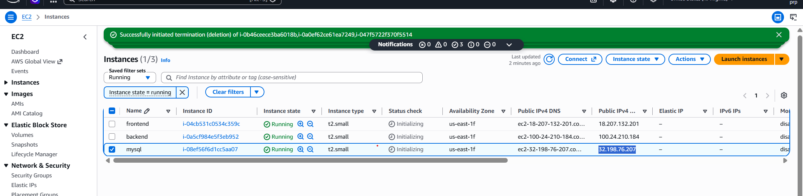
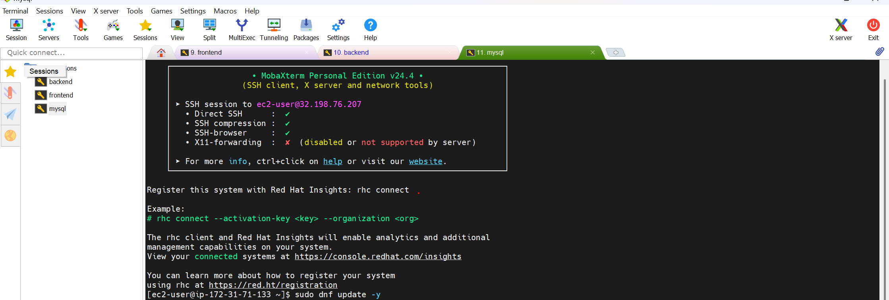
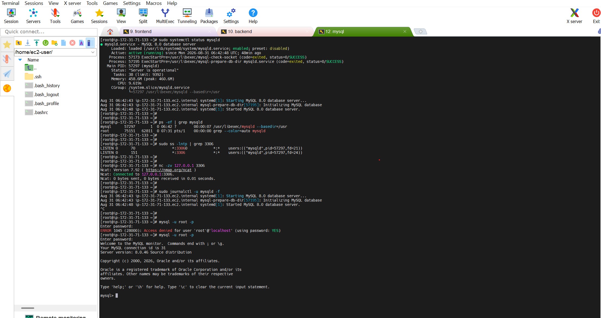
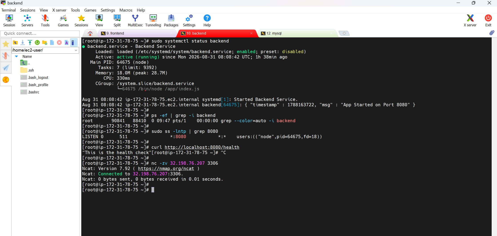
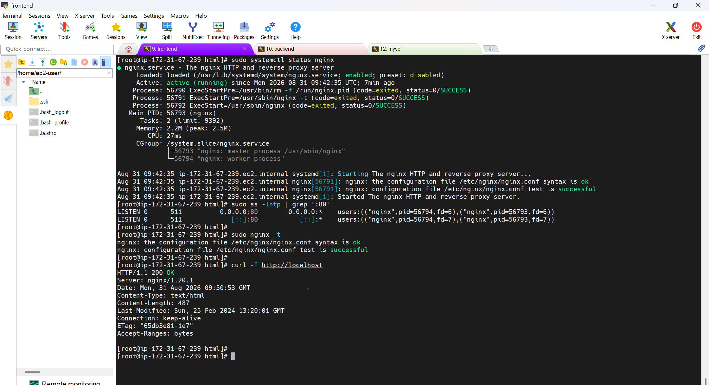
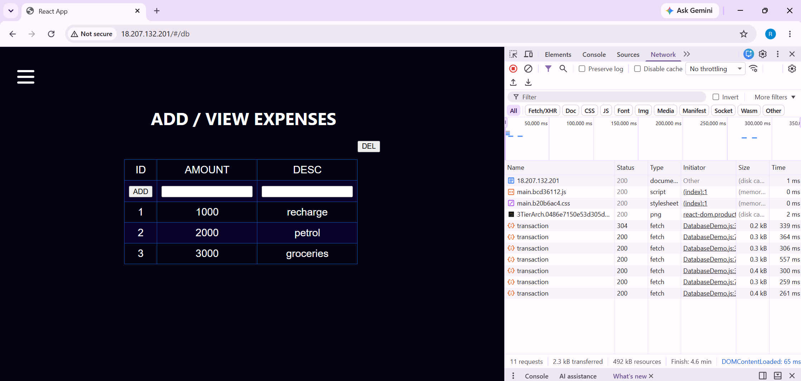
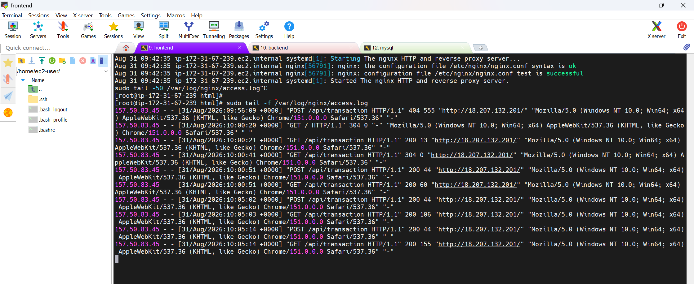
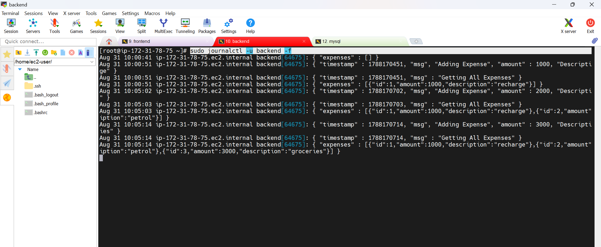
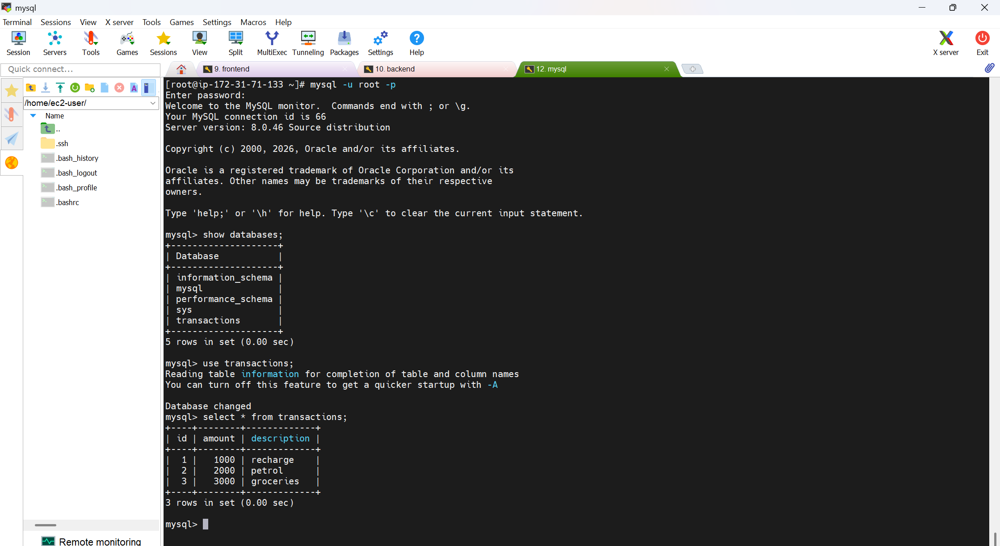

# Manual 3-Tier Expense Application Deployment

This document captures the **manual deployment and validation** of the Expense application, including proof screenshots and the troubleshooting checks used to verify the database, backend, frontend/Nginx, and connectivity between the layers.

> **Deployment approach:** Manual deployment on EC2 instances using SSH/MobaXterm, Linux services, MySQL, backend application, and Nginx.

---

## 📌 Architecture Flow

```text
                         Users / Browser
                                |
                                v
                     +---------------------+
                     |   Frontend / Nginx  |
                     |       Port 80       |
                     +----------+----------+
                                |
                                | HTTP :8080
                                v
                     +---------------------+
                     |       Backend       |
                     |       Port 8080     |
                     +----------+----------+
                                |
                                | MySQL :3306
                                v
                     +---------------------+
                     |        MySQL         |
                     |       Port 3306      |
                     +---------------------+
                                |
                                v
                     /var/lib/mysql/transactions/
```

---

# 1. Deployment Proof

## 1.1 AWS / EC2 Environment

The deployment was performed on EC2 instances and accessed through SSH/MobaXterm.



The initial server access and system preparation were performed using:

```bash
ssh <user>@<server-ip>
sudo dnf update -y
```

The deployment notes specifically document SSH access through MobaXterm and the initial `dnf` update.  

---

## 1.2 MySQL Database Configuration

The first major step was configuring the MySQL database instance and verifying that the MySQL server was running.



The database configuration was completed according to the deployment documentation.



### MySQL Validation

Check whether the MySQL service is running:

```bash
sudo systemctl status mysqld
```

Expected:

```text
Active: active (running)
```

Check the MySQL process:

```bash
ps -ef | grep mysqld
```

Expected process:

```text
/usr/sbin/mysqld
```

Check whether MySQL is listening on port `3306`:

```bash
sudo ss -lntp | grep 3306
```

Example:

```text
LISTEN 0 70 0.0.0.0:3306
```

This confirms that MySQL is listening on port `3306`.

Test MySQL locally:

```bash
nc -zv 127.0.0.1 3306
```

Expected:

```text
Connection to 127.0.0.1 3306 port [tcp/mysql] succeeded!
```

Follow MySQL logs in real time:

```bash
sudo journalctl -u mysqld -f
```

The troubleshooting notes use these checks to confirm the service, process, listening port, local connectivity, and live logs. 

---

# 2. Backend Deployment & Validation

After the database layer, the backend service was validated.



## Backend Checks

### 2.1 Check Backend Process / Service

If the backend is configured as a systemd service:

```bash
sudo systemctl status backend
```

If the service name is unknown:

```bash
ps -ef | grep -i backend
```

### 2.2 Check Backend Port

Assuming the backend runs on port `8080`:

```bash
sudo ss -lntp | grep 8080
```

Expected:

```text
LISTEN 0 128 0.0.0.0:8080
```

This confirms that the backend is listening on port `8080`.

### 2.3 Test Backend Locally

```bash
curl http://localhost:8080
```

If a health endpoint exists:

```bash
curl http://localhost:8080/health
```

A valid response confirms that the backend is reachable locally.

---

# 3. Backend → MySQL Connectivity

One of the most important validations in a 3-tier application is verifying that the backend server can reach the MySQL server.

From the backend EC2 instance:

```bash
nc -zv <MYSQL-IP> 3306
```

Example from the deployment troubleshooting notes:

```bash
nc -zv 32.198.76.207 3306
```

Expected:

```text
Connection to 32.198.76.207 3306 port [tcp/mysql] succeeded!
```

This confirms:

```text
Backend EC2
    |
    | TCP 3306
    v
MySQL EC2
```



### Backend Logs

Check the latest backend logs:

```bash
sudo journalctl -u backend -n 50
```

Follow backend logs live:

```bash
sudo journalctl -u backend -f
```

These commands help identify application startup issues, database connection failures, and runtime errors.

---

# 4. Frontend / Nginx Deployment

The frontend was exposed through Nginx on port `80`.



The browser proof shows the application UI and the expense records being displayed successfully.

## Nginx Validation

### Check Nginx Service

```bash
sudo systemctl status nginx
```

### Check Port 80

```bash
sudo ss -lntp | grep ':80'
```

### Validate Nginx Configuration

```bash
sudo nginx -t
```

A successful configuration test confirms that the Nginx configuration syntax is valid.

### Test Frontend Locally

```bash
curl -I http://localhost
```

This verifies that the frontend is locally reachable through Nginx.

---

# 5. Nginx Troubleshooting

When the frontend is not behaving as expected, check the Nginx error log:

```bash
sudo tail -50 /var/log/nginx/error.log
```

Check incoming requests:

```bash
sudo tail -50 /var/log/nginx/access.log
```

Follow access logs live:

```bash
sudo tail -f /var/log/nginx/access.log
```

Check Nginx service logs:

```bash
sudo journalctl -u nginx -n 50
```



### What These Logs Tell Us

| Command | Purpose |
|---|---|
| `systemctl status nginx` | Checks whether Nginx is running |
| `ss -lntp \| grep ':80'` | Checks whether Nginx is listening on port 80 |
| `nginx -t` | Validates Nginx configuration |
| `curl -I http://localhost` | Checks local frontend reachability |
| `tail -50 /var/log/nginx/error.log` | Checks Nginx errors |
| `tail -50 /var/log/nginx/access.log` | Checks whether client requests reach Nginx |
| `journalctl -u nginx -n 50` | Checks Nginx service logs |

---

# 6. Frontend → Backend Connectivity

If the frontend can load but API operations such as **adding products/expenses** fail, validate connectivity from the frontend server to the backend.

### Test Backend HTTP Connectivity

```bash
curl http://<BACKEND-IP>:8080
```

### Test Backend Port

```bash
nc -zv <BACKEND-IP> 8080
```

### Test Network Reachability

```bash
ping -c 3 <BACKEND-IP>
```

### Test Backend HTTP Response

```bash
curl -I http://<BACKEND-IP>:8080
```

These checks distinguish between:

```text
Application issue
        vs
Port / network issue
        vs
Backend service issue
```

---

# 7. Important Troubleshooting Fix

During frontend troubleshooting, if the frontend is unable to add products and a `404` error is observed from the frontend side, the deployment notes specify running:

```bash
sudo setsebool -P httpd_can_network_connect 1
```

Then retry the frontend operation and monitor the logs:

```bash
sudo tail -f /var/log/nginx/access.log
```

and:

```bash
sudo journalctl -u backend -f
```

This allows the troubleshooting process to verify both the frontend request and the backend response path.



---

# 8. Database Data Validation

After the application is working, the database can be checked directly to confirm that application data is being stored.



The deployment notes identify the MySQL data location as:

```text
/var/lib/mysql/transactions/
```

This provides an additional validation point:

```text
Browser
   ↓
Nginx
   ↓
Backend
   ↓
MySQL
   ↓
Transaction data
```

---

# 9. End-to-End Validation

The complete manual deployment can be validated layer by layer.

## Step 1 — MySQL

```bash
sudo systemctl status mysqld
sudo ss -lntp | grep 3306
nc -zv 127.0.0.1 3306
```

Expected:

```text
MySQL service = active (running)
MySQL port    = 3306 LISTEN
Local TCP     = succeeded
```

## Step 2 — Backend

```bash
sudo systemctl status backend
sudo ss -lntp | grep 8080
curl http://localhost:8080
```

Expected:

```text
Backend service = running
Backend port    = 8080 LISTEN
HTTP response   = successful
```

## Step 3 — Backend → MySQL

```bash
nc -zv <MYSQL-IP> 3306
```

Expected:

```text
Connection ... 3306 port [tcp/mysql] succeeded!
```

## Step 4 — Nginx

```bash
sudo systemctl status nginx
sudo ss -lntp | grep ':80'
sudo nginx -t
curl -I http://localhost
```

Expected:

```text
Nginx service = running
Port 80       = LISTEN
Config        = successful
HTTP          = successful
```

## Step 5 — Frontend → Backend

```bash
curl http://<BACKEND-IP>:8080
nc -zv <BACKEND-IP> 8080
curl -I http://<BACKEND-IP>:8080
```

## Step 6 — Browser

Open the frontend URL in a browser and verify that:

- The application loads.
- Existing expense records are displayed.
- New records can be added.
- Data is persisted in MySQL.

The attached deployment proof includes a working application view with expense records. 

---

# 10. Troubleshooting Decision Flow

```text
                Application not working
                         |
                         v
              Is Nginx running?
                    /          \
                  NO            YES
                  |              |
        systemctl status nginx  |
                  |              v
               Fix Nginx    Is frontend reachable?
                                 |
                          curl -I localhost
                                 |
                                 v
                    Is backend reachable?
                         /             \
                       NO               YES
                       |                 |
               Check backend       Check API behavior
               service/port        and application logs
                       |
                       v
              ss -lntp | grep 8080
              curl localhost:8080
                       |
                       v
              Can backend reach MySQL?
                         |
                         v
                nc -zv <MYSQL-IP> 3306
                         |
                  +------+------+
                  |             |
                 NO            YES
                  |             |
          Check network,     Check backend
          SG/firewall,       DB configuration
          MySQL listener    and application logs
```

---

# 11. Logs Quick Reference

### MySQL

```bash
sudo journalctl -u mysqld -f
```

### Backend

```bash
sudo journalctl -u backend -n 50
sudo journalctl -u backend -f
```

### Nginx

```bash
sudo journalctl -u nginx -n 50
sudo tail -50 /var/log/nginx/error.log
sudo tail -50 /var/log/nginx/access.log
sudo tail -f /var/log/nginx/access.log
```

---

# 12. Linux Service Management Concepts

The troubleshooting notes also document the relationship between `systemd`, `systemctl`, `journald`, and `journalctl`:

```text
systemd
   ↓
Service manager

systemctl
   ↓
Command used to control systemd services

journald
   ↓
Collects systemd service logs

journalctl
   ↓
Command used to view journald logs
```

For example:

```bash
sudo systemctl status nginx
```

checks the service status, while:

```bash
sudo journalctl -u nginx -n 50
```

shows recent logs for that service.

---

# 13. Network Troubleshooting — Traceroute

To understand the network path from one machine to another:

```bash
traceroute <DESTINATION-IP>
```

Purpose:

```text
Source machine
      ↓
   Network hops
      ↓
Destination machine
```

It helps identify the network path/hops between the source and destination.

---

# 14. Troubleshooting Checklist

| Layer | Validation | Command |
|---|---|---|
| MySQL | Service running | `sudo systemctl status mysqld` |
| MySQL | Process running | `ps -ef \| grep mysqld` |
| MySQL | Port 3306 listening | `sudo ss -lntp \| grep 3306` |
| MySQL | Local connectivity | `nc -zv 127.0.0.1 3306` |
| MySQL | Logs | `sudo journalctl -u mysqld -f` |
| Backend | Service running | `sudo systemctl status backend` |
| Backend | Port 8080 listening | `sudo ss -lntp \| grep 8080` |
| Backend | Local HTTP | `curl http://localhost:8080` |
| Backend → MySQL | TCP connectivity | `nc -zv <MYSQL-IP> 3306` |
| Backend | Logs | `sudo journalctl -u backend -f` |
| Nginx | Service running | `sudo systemctl status nginx` |
| Nginx | Port 80 listening | `sudo ss -lntp \| grep ':80'` |
| Nginx | Config validation | `sudo nginx -t` |
| Nginx | Local frontend | `curl -I http://localhost` |
| Nginx | Error logs | `sudo tail -50 /var/log/nginx/error.log` |
| Nginx | Access logs | `sudo tail -50 /var/log/nginx/access.log` |
| Frontend → Backend | HTTP | `curl http://<BACKEND-IP>:8080` |
| Frontend → Backend | TCP | `nc -zv <BACKEND-IP> 8080` |
| Network | Reachability | `ping -c 3 <BACKEND-IP>` |
| Network | Path | `traceroute <DESTINATION-IP>` |

---

# 15. Deployment Result

### ✅ Manual Deployment Completed

The deployment proof demonstrates the working application and the troubleshooting process covers:

- ✅ EC2 server access
- ✅ MySQL configuration and validation
- ✅ MySQL port `3306`
- ✅ Backend service and port `8080`
- ✅ Backend → MySQL connectivity
- ✅ Nginx service and port `80`
- ✅ Frontend accessibility
- ✅ Frontend → Backend connectivity checks
- ✅ Nginx access/error log troubleshooting
- ✅ Backend log troubleshooting
- ✅ MySQL data validation
- ✅ Network troubleshooting with `ping`, `nc`, `curl`, and `traceroute`

The key troubleshooting principle is:

> **Validate each layer independently first, then validate connectivity between the layers.**

This makes it easier to isolate whether a failure is caused by the **service, port, application, network connectivity, or database layer**.

---

## 📁 Proof Images

| Image | Proof |
|---|---|
| `image1.png` | AWS / EC2 environment |
| `image2.png` | MySQL configuration / server setup |
| `image3.png` | MySQL running / validation |
| `image4.png` | Backend validation |
| `image5.png` | Backend → MySQL connectivity |
| `image6.png` | Working frontend application |
| `image7.png` | Nginx troubleshooting/logs |
| `image8.png` | Backend troubleshooting/logs |
| `image9.png` | MySQL data validation |

---

### Source

The troubleshooting commands, validation flow, MySQL data location, traceroute usage, and the deployment proof screenshots in this README are based on the supplied `Troubleshooting_Steps.docx`.
