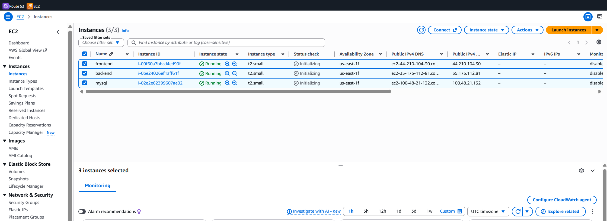
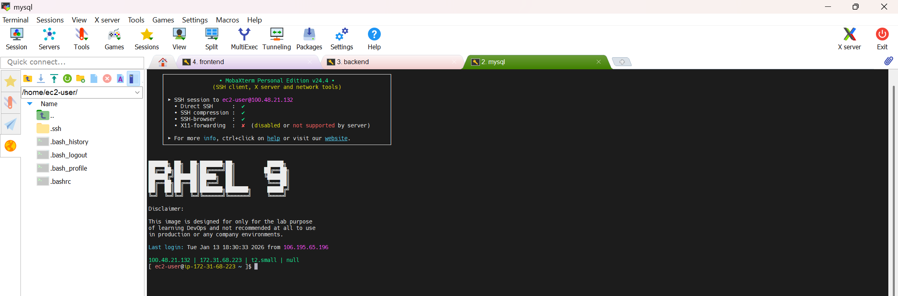
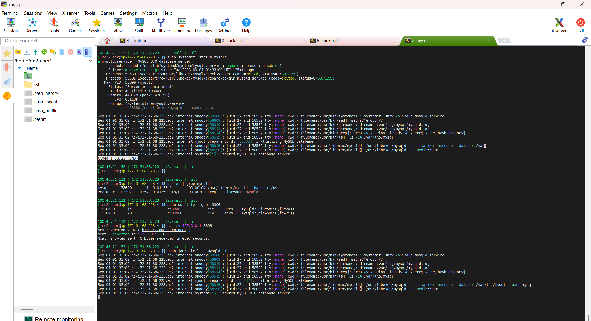
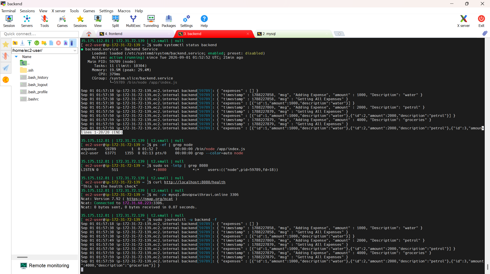
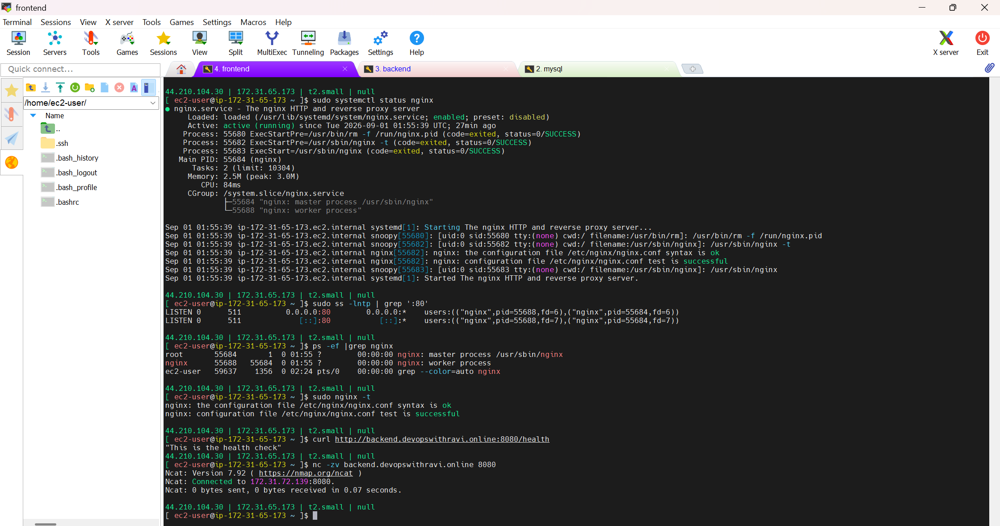
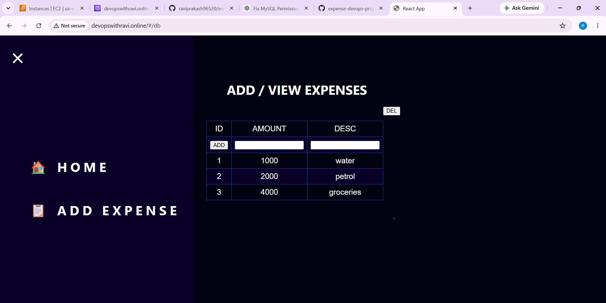
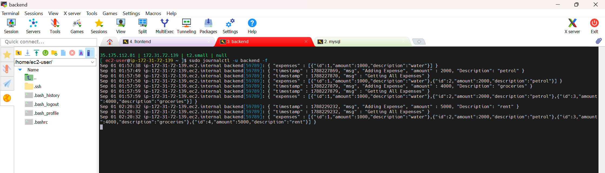
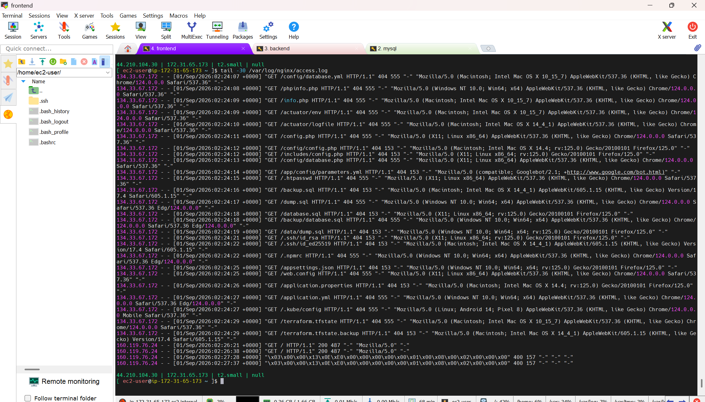
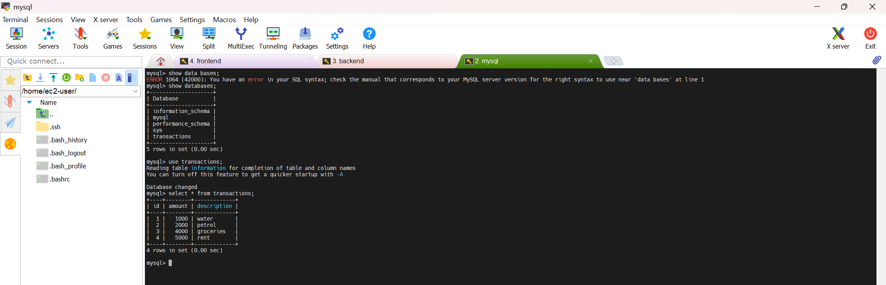

# Expense Application – Shell Script Deployment

This folder documents the **manual deployment of the Expense 3-Tier application using Bash/Shell scripts on AWS EC2**.

The deployment is automated through separate scripts for:

- MySQL
- Backend
- Frontend / Nginx

The repository contains the deployment scripts and supporting configuration files, while this README documents the **execution flow, validation, troubleshooting, and proof screenshots**.

> **Deployment type:** Shell Script / Bash based deployment  
> **Infrastructure:** AWS EC2  
> **Application:** Expense Application  
> **Architecture:** Frontend → Backend → MySQL

---

## 📌 Project Architecture

```text
                         Users / Browser
                                |
                                | HTTP :80
                                v
                  +--------------------------+
                  |      Frontend EC2        |
                  |       Nginx :80          |
                  |                          |
                  |   Static Expense UI      |
                  +------------+-------------+
                               |
                               | /api/*
                               | HTTP :8080
                               v
                  +--------------------------+
                  |       Backend EC2        |
                  |      Node.js :8080       |
                  |                          |
                  |     systemd service      |
                  +------------+-------------+
                               |
                               | MySQL :3306
                               v
                  +--------------------------+
                  |        MySQL EC2         |
                  |       MySQL :3306        |
                  |                          |
                  |      transactions DB     |
                  +--------------------------+
```

The deployment proof shows three EC2 instances named **frontend**, **backend**, and **mysql**, all running in AWS. citeturn0view0



---

# 1. Repository Structure

The `02-Expense_Shell` directory contains the deployment automation files:

```text
02-Expense_Shell/
│
├── mysql.sh
├── backend.sh
├── frontend.sh
├── backend.service
├── expense.conf
└── troubleshooting_and_proof_of_images.docx
```

The GitHub directory currently contains these deployment files. citeturn0view0

---

# 2. Shell Script Design

The scripts follow a common pattern:

```text
Start Script
     |
     v
Check Root / Sudo Access
     |
     v
Create Log Directory
     |
     v
Install / Configure Components
     |
     v
Validate Every Important Command
     |
     +---- Failure ---> Print FAILURE + Exit
     |
     v
Continue Deployment
     |
     v
Start / Restart Service
     |
     v
Application Ready
```

Each script contains a `VALIDATE()` function that checks the previous command's exit status.

```bash
if [ $1 -ne 0 ]
then
    echo "FAILURE"
    exit 1
else
    echo "SUCCESS"
fi
```

The scripts also check whether they are being executed with root/sufficient privileges. citeturn1view0turn1view1turn2view0

---

# 3. Logging

The scripts create deployment logs under:

```text
/var/log/expense-logs/
```

The log filename contains the script name and timestamp.

Example:

```text
/var/log/expense-logs/backend-YYYY-MM-DD-HH-MM-SS.log
```

This is useful because deployment failures can be investigated without depending only on the terminal output.

---

# 4. Step 1 – MySQL Deployment

The MySQL deployment is handled by:

```text
mysql.sh
```

The script performs the following operations:

```text
MySQL Deployment
      |
      +--> Check root access
      |
      +--> Create log directory
      |
      +--> Install MySQL Server
      |
      +--> Enable mysqld
      |
      +--> Start mysqld
      |
      +--> Check MySQL root password
      |
      +--> Set root password if required
      |
      v
   MySQL Ready
```

The actual repository script installs `mysql-server`, enables and starts `mysqld`, then verifies whether the MySQL root password has already been configured. citeturn2view0

## Run the Script

```bash
sudo bash mysql.sh
```

The script contains the MySQL installation and service configuration steps:

```bash
dnf install mysql-server -y

systemctl enable mysqld

systemctl start mysqld
```

It also checks the database connection and performs root-password setup when required. citeturn2view0

> **Security note:** Do not commit real database passwords to GitHub. Use environment variables, AWS Secrets Manager, SSM Parameter Store, or another secret-management solution for production.

---

## 4.1 MySQL Validation

After deployment:

### Check MySQL Service

```bash
sudo systemctl status mysqld
```

Expected:

```text
Active: active (running)
```

### Check MySQL Process

```bash
ps -ef | grep mysqld
```

Expected process:

```text
/usr/libexec/mysqld
```

### Check Port 3306

```bash
sudo ss -lntp | grep 3306
```

Expected:

```text
LISTEN ... :3306
```

### Test Local Connectivity

```bash
nc -zv 127.0.0.1 3306
```

Expected:

```text
Connection to 127.0.0.1 3306 port [tcp/mysql] succeeded!
```

### Check Live MySQL Logs

```bash
sudo journalctl -u mysqld -f
```

The proof screenshot demonstrates all of these validation checks, including `systemctl`, `ps`, `ss`, `nc`, and `journalctl`. 





---

# 5. Step 2 – Backend Deployment

The backend deployment is handled by:

```text
backend.sh
```

The script prepares the Node.js backend and configures it as a systemd service.

## Backend Deployment Flow

```text
backend.sh
    |
    +--> Check root access
    |
    +--> Configure NodeJS 20
    |
    +--> Install NodeJS
    |
    +--> Create expense user
    |
    +--> Create /app
    |
    +--> Download backend ZIP
    |
    +--> Extract application
    |
    +--> npm install
    |
    +--> Install MySQL client
    |
    +--> Load backend schema
    |
    +--> Install backend.service
    |
    +--> daemon-reload
    |
    +--> enable backend
    |
    +--> restart backend
    |
    v
 Backend Ready
```

The repository `backend.sh` disables the default Node.js module, enables Node.js 20, installs Node.js, creates the `expense` user when necessary, downloads the backend package, extracts it under `/app`, runs `npm install`, loads the backend schema, and starts the systemd service. citeturn1view0

---

## 5.1 Run Backend Script

```bash
sudo bash backend.sh
```

Important deployment steps performed by the script include:

```bash
dnf module disable nodejs -y
dnf module enable nodejs:20 -y
dnf install nodejs -y

mkdir -p /app

curl -o /tmp/backend.zip <BACKEND_ARTIFACT_URL>

cd /app
unzip /tmp/backend.zip

npm install
```

The backend script then copies the service definition, prepares the MySQL schema, reloads systemd, enables the backend service, and restarts it. citeturn1view0

---

# 6. Backend systemd Service

The repository contains:

```text
backend.service
```

The service is configured to run the Node.js application as the `expense` user.

Important configuration:

```ini
[Service]
User=expense
Environment=DB_HOST="mysql.devopswithravi.online"
ExecStart=/bin/node /app/index.js
SyslogIdentifier=backend
```

The service is enabled through:

```text
multi-user.target
```

This configuration is present in the repository's `backend.service`. citeturn2view1

---

# 7. Backend Validation

### Check Service

```bash
sudo systemctl status backend
```

Expected:

```text
Active: active (running)
```

### Check Node.js Process

```bash
ps -ef | grep node
```

### Check Port 8080

```bash
sudo ss -lntp | grep 8080
```

Expected:

```text
LISTEN ... :8080
```

### Test Health Endpoint

```bash
curl http://localhost:8080/health
```

Expected:

```text
This is the health check
```

### Test Backend → MySQL

From backend EC2:

```bash
nc -zv <MYSQL-IP> 3306
```

or:

```bash
nc -zv mysql.devopswithravi.online 3306
```

Expected:

```text
Connection to ... 3306 port [tcp/mysql] succeeded!
```

### Backend Logs

```bash
sudo journalctl -u backend -f
```

The proof screenshot shows the backend service running, Node.js listening on `8080`, the health endpoint responding, backend-to-MySQL connectivity succeeding, and backend application logs showing expense operations. 



---

# 8. Step 3 – Frontend Deployment

The frontend deployment is handled by:

```text
frontend.sh
```

The frontend is served using Nginx.

## Frontend Deployment Flow

```text
frontend.sh
      |
      +--> Check root access
      |
      +--> Create log directory
      |
      +--> Install Nginx
      |
      +--> Enable Nginx
      |
      +--> Start Nginx
      |
      +--> Remove old frontend code
      |
      +--> Download frontend ZIP
      |
      +--> Extract into Nginx HTML directory
      |
      +--> Copy expense.conf
      |
      +--> Restart Nginx
      |
      v
 Frontend Ready
```

The repository script installs Nginx, enables and starts it, removes the previous frontend version, downloads the frontend package, extracts it into `/usr/share/nginx/html`, copies the Nginx configuration, and restarts Nginx. citeturn1view1

---

## 8.1 Run Frontend Script

```bash
sudo bash frontend.sh
```

Important operations:

```bash
dnf install nginx -y

systemctl enable nginx

systemctl start nginx

rm -rf /usr/share/nginx/html/*

curl -o /tmp/frontend.zip <FRONTEND_ARTIFACT_URL>

cd /usr/share/nginx/html

unzip /tmp/frontend.zip

cp expense.conf /etc/nginx/default.d/expense.conf

systemctl restart nginx
```

---

# 9. Nginx Configuration

The repository contains:

```text
expense.conf
```

The configuration acts as the bridge between the frontend and backend.

The `/api/` requests are proxied to the backend:

```nginx
location /api/ {
    proxy_pass http://backend.devopswithravi.online:8080/;
}
```

The `/health` location is configured for Nginx status information. citeturn2view2

### Request Flow

```text
Browser
   |
   | http://frontend
   v
Nginx :80
   |
   | /api/*
   v
Backend :8080
   |
   v
MySQL :3306
```

---

# 10. Frontend / Nginx Validation

### Check Nginx Service

```bash
sudo systemctl status nginx
```

Expected:

```text
Active: active (running)
```

### Check Port 80

```bash
sudo ss -lntp | grep ':80'
```

Expected:

```text
LISTEN ... :80
```

### Check Nginx Process

```bash
ps -ef | grep nginx
```

### Validate Nginx Configuration

```bash
sudo nginx -t
```

Expected:

```text
syntax is ok
test is successful
```

### Test Backend from Frontend Server

```bash
curl http://backend.devopswithravi.online:8080/health
```

Expected:

```text
This is the health check
```

### Test Backend Port

```bash
nc -zv backend.devopswithravi.online 8080
```

The proof screenshot shows Nginx running, port `80` listening, the Nginx process running, successful `nginx -t`, backend health response, and successful TCP connectivity to backend port `8080`. 



---

# 11. Application Validation

After all three layers are deployed, open the frontend URL in a browser.

The application should provide:

- Home page
- Add Expense
- View Expenses
- Expense ID
- Amount
- Description

The proof screenshot shows the Expense application successfully displaying records:

```text
ID    AMOUNT    DESC
1     1000      water
2     2000      petrol
3     4000      groceries
```



This confirms that the frontend is successfully serving the application.

---

# 12. End-to-End Application Flow

When a user adds an expense:

```text
User
 |
 | Add Expense
 v
Frontend
 |
 | POST /api/...
 v
Nginx
 |
 | proxy_pass
 v
Backend :8080
 |
 | Database request
 v
MySQL :3306
 |
 | INSERT
 v
transactions table
```

When the user views expenses:

```text
MySQL
  |
  | SELECT
  v
Backend
  |
  | JSON response
  v
Nginx
  |
  v
Frontend
  |
  v
Expense Table
```

---

# 13. Troubleshooting

The deployment was not considered complete merely because the scripts finished. Each layer was independently validated.

---

## 13.1 MySQL Troubleshooting

### Problem: MySQL service is not running

Check:

```bash
sudo systemctl status mysqld
```

If required:

```bash
sudo systemctl restart mysqld
```

Check logs:

```bash
sudo journalctl -u mysqld -n 50
```

### Problem: Port 3306 is not listening

```bash
sudo ss -lntp | grep 3306
```

If nothing is returned, inspect the MySQL service and logs.

### Problem: Backend cannot reach MySQL

From backend:

```bash
nc -zv <MYSQL-IP> 3306
```

Also verify:

```text
MySQL service
MySQL listener
Security Group
Network connectivity
DNS resolution
Backend DB_HOST
```

---

# 14. Backend Troubleshooting

### Check Service

```bash
sudo systemctl status backend
```

### Check Process

```bash
ps -ef | grep node
```

### Check Port

```bash
sudo ss -lntp | grep 8080
```

### Check Health

```bash
curl http://localhost:8080/health
```

### Check Logs

```bash
sudo journalctl -u backend -n 50
```

Live logs:

```bash
sudo journalctl -u backend -f
```

The backend proof also shows application log entries for adding expenses and retrieving all expenses. 



---

# 15. Nginx / Frontend Troubleshooting

### Check Nginx

```bash
sudo systemctl status nginx
```

### Check Port 80

```bash
sudo ss -lntp | grep ':80'
```

### Validate Configuration

```bash
sudo nginx -t
```

### Check Error Logs

```bash
sudo tail -50 /var/log/nginx/error.log
```

### Check Access Logs

```bash
sudo tail -50 /var/log/nginx/access.log
```

### Follow Access Logs

```bash
sudo tail -f /var/log/nginx/access.log
```

The supplied proof includes Nginx access-log output showing HTTP requests and `404` responses for unrelated paths, which is useful for demonstrating how access logs can be inspected during troubleshooting. 



---

# 16. Frontend → Backend Troubleshooting

If the frontend loads but API operations fail:

### Test Backend HTTP

```bash
curl http://backend.devopswithravi.online:8080/health
```

### Test Backend TCP Port

```bash
nc -zv backend.devopswithravi.online 8080
```

### Test Network Reachability

```bash
ping -c 3 <BACKEND-IP>
```

### Test HTTP Headers

```bash
curl -I http://<BACKEND-IP>:8080
```

This helps determine whether the problem is:

```text
Frontend
   |
   +--> Nginx problem
   |
   +--> DNS problem
   |
   +--> Network / Security Group problem
   |
   +--> Backend service problem
   |
   +--> Application/API problem
```

---

# 17. Database Validation

Once expenses are added through the UI, validate the data directly in MySQL.

Connect to MySQL:

```bash
mysql -u root -p
```

List databases:

```sql
SHOW DATABASES;
```

Select the transactions database:

```sql
USE transactions;
```

Check stored records:

```sql
SELECT * FROM transactions;
```

The proof shows the `transactions` database and the stored expense records:

```text
id | amount | description
---+--------+------------
1  | 1000   | water
2  | 2000   | petrol
3  | 4000   | groceries
4  | 5000   | rent
```

This provides direct proof that the data entered through the application reached MySQL successfully.



---

# 18. Complete Validation Checklist

| Layer | Check | Command | Expected |
|---|---|---|---|
| EC2 | Instances running | AWS Console | frontend/backend/mysql running |
| MySQL | Service | `systemctl status mysqld` | active |
| MySQL | Process | `ps -ef \| grep mysqld` | mysqld process |
| MySQL | Port | `ss -lntp \| grep 3306` | 3306 listening |
| MySQL | Local TCP | `nc -zv 127.0.0.1 3306` | succeeded |
| Backend | Service | `systemctl status backend` | active |
| Backend | Process | `ps -ef \| grep node` | node process |
| Backend | Port | `ss -lntp \| grep 8080` | 8080 listening |
| Backend | Health | `curl localhost:8080/health` | successful response |
| Backend → MySQL | Connectivity | `nc -zv <MYSQL-IP> 3306` | succeeded |
| Nginx | Service | `systemctl status nginx` | active |
| Nginx | Port | `ss -lntp \| grep ':80'` | 80 listening |
| Nginx | Config | `nginx -t` | successful |
| Frontend → Backend | HTTP | `curl <BACKEND>:8080/health` | successful |
| Frontend → Backend | TCP | `nc -zv <BACKEND> 8080` | succeeded |
| Application | Browser | Open frontend URL | Expense UI |
| Database | Data | `SELECT * FROM transactions;` | expense records |

---

# 19. Troubleshooting Decision Flow

```text
                  Application Not Working
                           |
                           v
                   Is Nginx running?
                      /         \
                    NO           YES
                    |             |
          Check nginx service     v
                    |       Is frontend loading?
                    |          /       \
                    |        NO         YES
                    |        |           |
                    |   Check Nginx   Test API
                    |   config/logs      |
                    |                   v
                    |           Is backend reachable?
                    |              /          \
                    |            NO            YES
                    |            |              |
                    |      Check backend     Check API
                    |      service/port      application
                    |            |
                    |            v
                    |      Is MySQL reachable?
                    |          /       \
                    |        NO         YES
                    |        |           |
                    |   Check 3306,     Check DB
                    |   SG/network      configuration
                    |
                    v
                 Fix Layer
                    |
                    v
               Retest End-to-End
```

---

# 20. Shell Deployment vs Manual Deployment

This project demonstrates the same 3-tier deployment approach but uses **Shell scripting to automate repetitive server configuration tasks**.

```text
Manual Deployment
------------------
Install package
Configure service
Download application
Configure database
Start service
Validate
Repeat manually


Shell Deployment
----------------
Run mysql.sh
Run backend.sh
Run frontend.sh
       |
       v
Automated installation
Automated configuration
Automated validation
Automated logging
```

The main advantage of the shell approach is consistency and repeatability.

---

# 21. What This Project Demonstrates

### AWS

- EC2
- Security Groups
- Public/Private connectivity concepts
- DNS-based service communication

### Linux

- `systemctl`
- `systemd`
- `journalctl`
- Processes
- Ports
- Service management
- Linux filesystem

### Shell Scripting

- Bash scripting
- Functions
- Exit status `$?`
- Conditional statements
- Root validation
- Logging
- Command validation
- Automation

### Application Deployment

- Node.js
- npm
- Nginx
- MySQL
- systemd
- Frontend/backend integration

### Troubleshooting

- `ps`
- `ss`
- `nc`
- `curl`
- `ping`
- `journalctl`
- Nginx access/error logs
- Application logs
- Database validation

---

# 22. Final Deployment Result

```text
             ✅ EC2 Infrastructure
                      |
                      v
             ✅ MySQL Deployment
                      |
                      v
             ✅ Backend Deployment
                      |
                      v
             ✅ Nginx Deployment
                      |
                      v
             ✅ Frontend Deployment
                      |
                      v
             ✅ Backend → MySQL Connectivity
                      |
                      v
             ✅ Frontend → Backend Connectivity
                      |
                      v
             ✅ Expense Application Working
                      |
                      v
             ✅ Data Stored in MySQL
```

The supplied proof demonstrates the complete working flow: the three EC2 instances are running, MySQL is active and listening on `3306`, the backend is active on `8080`, Nginx is active on `80`, the application UI is accessible, backend logs show expense operations, and MySQL contains the resulting transaction records.

---

## 📸 Proof Images

All proof screenshots from the supplied Word document are included in:

```text
docs/images/
```

| Image | Purpose |
|---|---|
| `image1.png` | AWS EC2 instances |
| `image2.png` | MobaXterm / MySQL server access |
| `image3.png` | MySQL service, process, port and logs |
| `image4.png` | Backend service, health check, port and DB connectivity |
| `image5.png` | Nginx service, port, config and backend connectivity |
| `image6.png` | Working Expense application |
| `image7.png` | Nginx access-log troubleshooting |
| `image8.png` | Backend application logs |
| `image9.png` | MySQL transaction data |

---

## 🔗 Repository

The shell deployment implementation is available under:

```text
02-Expense_Shell/
```

Repository:

https://github.com/raviprakash96520/expense-devops-project/tree/main/02-Expense_Shell

The repository contains the Bash scripts and configuration used for this deployment. citeturn0view0

---

## ⚠️ Production Security Note

This project is intended as a DevOps learning/project implementation.

For a production environment:

- Do not hard-code database passwords in shell scripts.
- Do not expose MySQL directly to the public internet.
- Use private subnets for database infrastructure.
- Restrict Security Group rules to required sources and ports.
- Store secrets in AWS Secrets Manager / SSM Parameter Store.
- Use HTTPS/TLS for the frontend.
- Use least-privilege IAM and Linux permissions.
- Avoid committing sensitive credentials to Git.

---

# 🚀 Summary

This project demonstrates how a **3-Tier Expense Application can be deployed on AWS EC2 using Bash automation**.

The deployment is split into three independent scripts:

```text
mysql.sh
   ↓
MySQL Server

backend.sh
   ↓
Node.js Backend + systemd

frontend.sh
   ↓
Nginx + Frontend
```

The deployment is then validated end-to-end:

```text
Browser
   ↓
Nginx :80
   ↓
Backend :8080
   ↓
MySQL :3306
   ↓
transactions database
```

**Result: Shell-script-based deployment completed successfully with service-level, network-level, application-level, and database-level validation.**
