# Expense Application — Docker Deployment

## Why Docker?

The Expense application has three components with different runtime requirements: an Nginx frontend, a Node.js backend, and a MySQL database. Installing and configuring them directly on a server makes deployment dependent on that server's installed software and configuration.

Docker packages each component with its runtime and dependencies into a versioned image. This project uses Docker to:

- **Make deployments repeatable:** reuse the same images on compatible Docker hosts.
- **Separate components:** run the frontend, backend, and database in individual containers.
- **Simplify connectivity:** use container names on a shared Docker network instead of hardcoded container IP addresses.
- **Preserve database files:** mount a named volume at MySQL's data directory.
- **Distribute builds:** push versioned images to Docker Hub.
- **Define the application together:** use Docker Compose to manage the three services.

This is a single-host learning deployment on EC2. It demonstrates containerization, networking, storage, and troubleshooting; it does not provide multi-host high availability.

## Project Overview

The Expense application lets users add and view expenses through a browser. Nginx serves the frontend and forwards API requests to the backend. The backend reads and writes records in MySQL.

**Source:** [05-Expense-Docker](https://github.com/raviprakash96520/expense-devops-project/tree/main/05-Expense-Docker)

The screenshots below document the actual lab: EC2 setup, image builds, manual container deployment, DNS configuration, application checks, database verification, and Docker Compose deployment. Commands use image tag `1.0.0`, matching the captured images and repository Compose file.

## Architecture

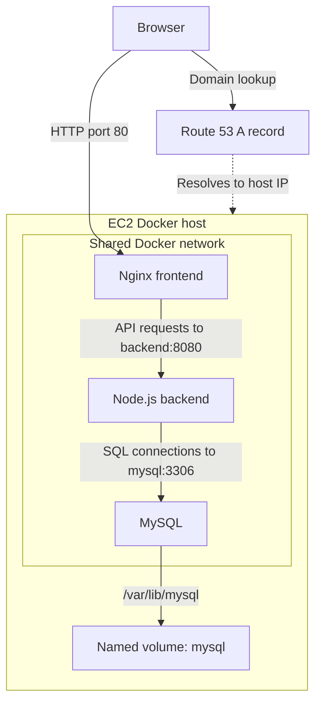

Route 53 resolves the domain to the EC2 public IP; it does not proxy application traffic. Within the Docker network, `backend` and `mysql` resolve through Docker's built-in DNS.

| Component | Image | Container port | Purpose |
| --- | --- | --- | --- |
| Frontend | `ravi96520/frontend:1.0.0` | 80 | Static UI and reverse proxy |
| Backend | `ravi96520/backend:1.0.0` | 8080 | Express API |
| Database | `ravi96520/mysql:1.0.0` | 3306 | Expense storage |

Only frontend port 80 is published by the repository's Compose file. The manual deployment below also binds backend port 8080 to the host loopback interface for troubleshooting.

## Repository Files

Paths are relative to `05-Expense-Docker/`.

| Path | Responsibility |
| --- | --- |
| `frontend/Dockerfile` | Packages the frontend with Nginx and runs as the `nginx` user |
| `frontend/nginx.conf` | Serves static files and forwards `/api/` to `http://backend:8080/` |
| `frontend/code/` | Prebuilt frontend assets |
| `backend/Dockerfile` | Builds the Node.js application in stages and runs as the `expense` user |
| `backend/DbConfig.js` | Default database settings |
| `backend/index.js` | API routes and application startup |
| `backend/TransactionService.js` | Database operations |
| `mysql/Dockerfile` | Builds on MySQL 8.0 and copies initialization SQL |
| `mysql/scripts/backend.sql` | Creates the database, table, application user, and grants |
| `docker-compose.yaml` | Defines services, networking, and the external MySQL volume |

## 1. Prepare the EC2 Host

The lab used one `t2.medium` EC2 instance and a RHEL-based installation workflow. Run the following Linux commands **on the EC2 host**, after connecting over SSH.

Prerequisites:

- An EC2 host with internet access for packages, Git, and container images.
- SSH access restricted to your administration IP.
- Inbound TCP 80 allowed for the intended website users.
- Docker Hub access if building and pushing images.
- A Route 53 public hosted zone and domain if using custom DNS.

MySQL does not need a public inbound rule. Containers reach it over their shared Docker network.

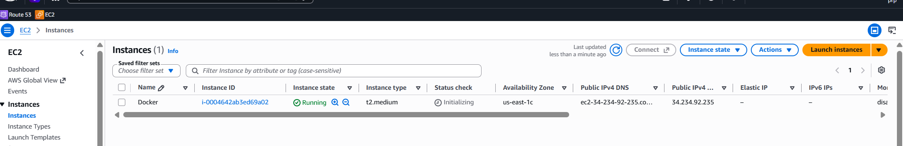

### Install Docker Engine and Compose

```bash
sudo dnf -y install dnf-plugins-core git
sudo dnf config-manager --add-repo https://download.docker.com/linux/rhel/docker-ce.repo
sudo dnf install -y docker-ce docker-ce-cli containerd.io docker-buildx-plugin docker-compose-plugin
sudo systemctl enable --now docker
sudo usermod -aG docker ec2-user
```

Reconnect your SSH session so the group change takes effect. Membership in the `docker` group grants privileged control of the host.

```bash
docker --version
docker compose version
docker info
```

The screenshot records the Docker version installed during the lab; an installation performed later may return a different version.

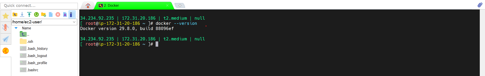

## 2. Clone the Repository

```bash
git clone https://github.com/raviprakash96520/expense-devops-project.git
cd expense-devops-project/05-Expense-Docker
```

Run subsequent host commands from this directory unless a step says otherwise.

## 3. Build and Push Images

### Build all three components

```bash
docker build -t ravi96520/mysql:1.0.0 ./mysql
docker build -t ravi96520/backend:1.0.0 ./backend
docker build -t ravi96520/frontend:1.0.0 ./frontend

docker images
```

The backend uses a multi-stage Dockerfile and runs as a non-root application user. The frontend copies the prebuilt website into Nginx. The MySQL image copies SQL into `/docker-entrypoint-initdb.d/` for initialization of an empty data directory.

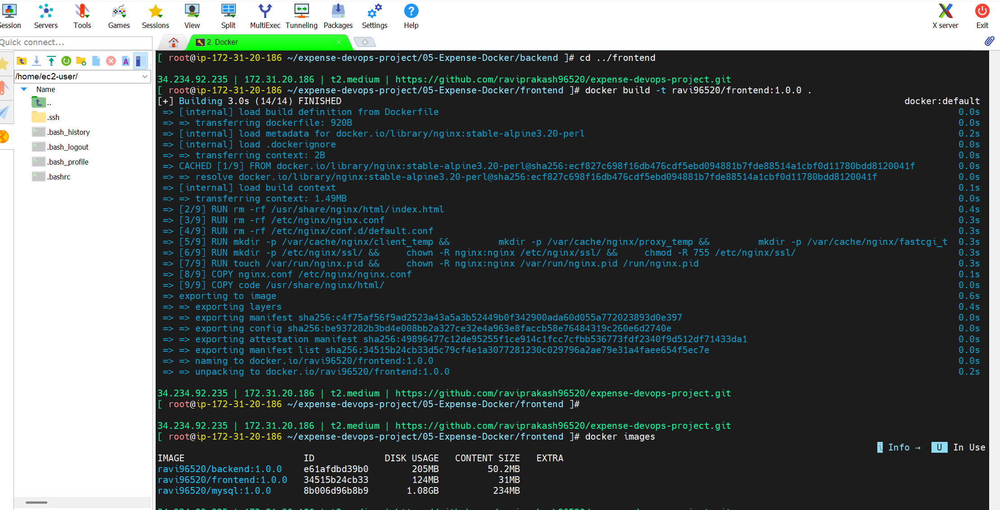

### Push to Docker Hub

```bash
docker login

docker push ravi96520/mysql:1.0.0
docker push ravi96520/backend:1.0.0
docker push ravi96520/frontend:1.0.0
```

Use your own Docker Hub namespace when reproducing this project under another account, and update the image references in Compose accordingly. The project notes record that images were pushed; the screenshot above shows the build and local image listing.

## 4. Deploy with Docker Run

This route demonstrates how the individual containers connect. To deploy directly with Compose, skip to [Section 8](#8-deploy-with-docker-compose).

### Create the network and persistent volume

```bash
docker network create expense
docker volume create mysql
```

### Start MySQL

```bash
docker run -d \
  --name mysql \
  --network expense \
  -v mysql:/var/lib/mysql \
  ravi96520/mysql:1.0.0

docker logs --tail 100 mysql
```

Wait for MySQL initialization to finish before starting the backend. Confirm authenticated access interactively using the lab's configured database password:

```bash
docker exec -it mysql mysql -u root -p \
  -e 'SELECT 1; SHOW DATABASES;'
```

### Start the backend

```bash
docker run -d \
  --name backend \
  --network expense \
  -e DB_HOST=mysql \
  -p 127.0.0.1:8080:8080 \
  ravi96520/backend:1.0.0
```

The backend Dockerfile already sets `DB_HOST=mysql`; supplying it explicitly makes the connection target visible. The loopback binding allows host-side API checks without exposing the API publicly.

### Start the frontend

```bash
docker run -d \
  --name frontend \
  --network expense \
  -p 80:80 \
  ravi96520/frontend:1.0.0

docker ps
```

The original lab screenshot published backend port 8080 on all host interfaces. The documented command above deliberately restricts that diagnostic port to `127.0.0.1`. Frontend traffic still reaches `backend:8080` over the Docker network.

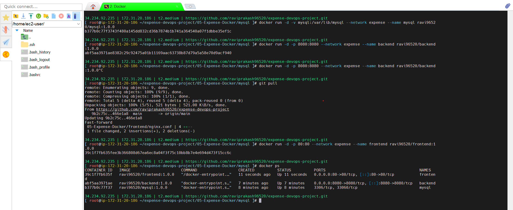

## 5. Configure DNS and Access the Website

Create or update a Route 53 **A record** in your public hosted zone:

| Setting | Value |
| --- | --- |
| Record name | Your application domain |
| Type | A |
| Value | Current EC2 public IPv4 address |
| Routing policy | Simple |

The lab used `devopswithravi.online`. The address shown in the screenshot is historical; use your own host's current address. An Elastic IP can keep the DNS target stable across instance stop/start operations.

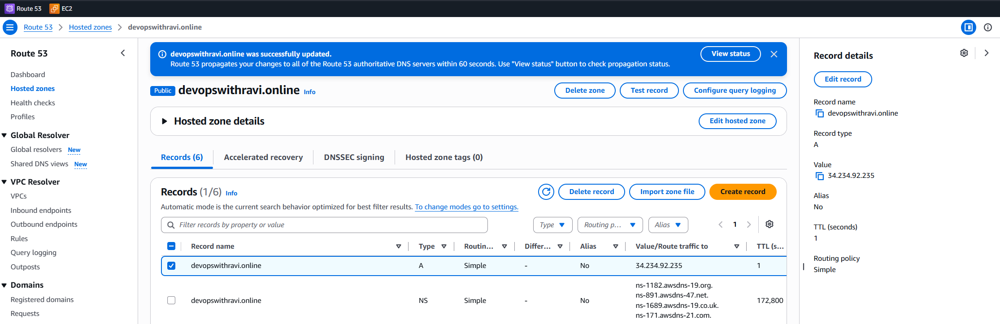

Open `http://<your-domain>/` and navigate to **Add Expenses**. For the demonstrated frontend, the expense page uses `/#/db`.

The initial test added these records:

| Amount | Description |
| --- | --- |
| 1000 | petrol |
| 2000 | groceries |
| 3000 | rent |

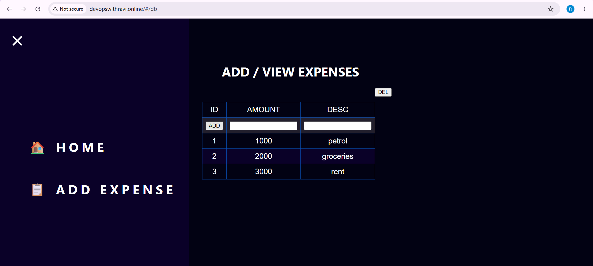

This lab uses HTTP. DNS configuration alone does not enable HTTPS.

## 6. Verify Database Storage

### Check the volume mount

```bash
docker inspect mysql --format '{{range .Mounts}}{{.Type}} {{.Name}} -> {{.Destination}}{{println}}{{end}}'
```

The `mysql` volume should be mounted at `/var/lib/mysql`. This keeps database files outside the container's writable layer.

### Query the database

```bash
docker exec -it mysql mysql -u root -p
```

Run the following at the MySQL prompt:

```sql
SHOW DATABASES;
USE transactions;
SHOW TABLES;
SELECT id, amount, description FROM transactions;
EXIT;
```

The screenshot shows the named volume mount and the same three expense records visible in the UI.

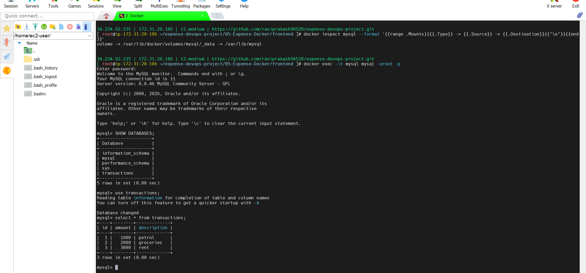

**Persistence behavior:** removing a container does not remove this named volume. Reusing it preserves the database on the same Docker host. A local Docker volume is not a backup and does not survive loss of its underlying host storage.

MySQL initialization SQL runs when the data directory is empty. Editing initialization scripts or image environment defaults does not automatically modify users, passwords, or schemas in an already initialized volume.

## 7. Troubleshoot Each Layer

### Backend: logs, routes, and connectivity

```bash
docker logs backend --tail 100
```

For the manual deployment with loopback port 8080 published:

```bash
curl -i http://localhost:8080/health
curl -i http://localhost:8080/transaction
```

For either deployment route, check through the frontend proxy:

```bash
curl -i http://localhost/api/health
curl -i http://localhost/api/transaction
```

Check backend-to-database connectivity:

```bash
docker exec backend ping -c 3 mysql
docker exec backend nc -zv mysql 3306
```

These diagnostic utilities are used in the supplied lab screenshot; availability depends on the container image.

| Observation | Interpretation |
| --- | --- |
| `Cannot GET /` on backend port 8080 | Express is reachable, but the backend has no GET route for `/` |
| `/health` returns a response | API process is responding; this endpoint does not validate database connectivity |
| `mysql` resolves to a container IP | Docker DNS can resolve the database name |
| `nc` reports port 3306 open | TCP connection to MySQL succeeds; credentials still need separate validation |
| Transaction query returns expected rows | The application can retrieve stored expense data |

The captured check first requested `/` and received `Cannot GET /`, then successfully called `/health`, resolved `mysql`, and tested port 3306. This was a route-selection issue, not evidence that the backend was down.

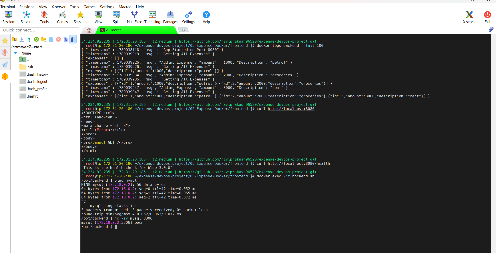

### Frontend: HTTP response and Nginx logs

```bash
curl -I http://localhost/
docker exec frontend nginx -t
docker logs frontend --tail 100
```

The screenshot shows a successful HTTP response and API access logs. It also contains a missing-file message related to a favicon request; investigate the requested path rather than treating every missing static asset as a complete application outage.

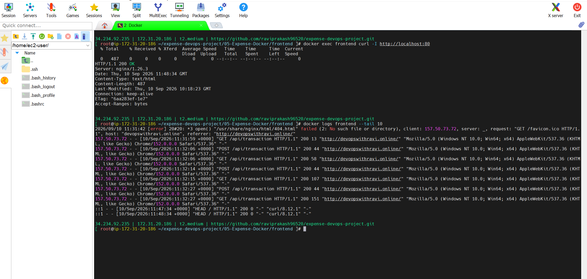

### Common checks

| Symptom | What to check |
| --- | --- |
| Website times out | EC2 public IP, Route 53 record, security group, frontend state, and port 80 mapping |
| Nginx returns 502 | Backend process, port 8080, shared network, and the `backend` DNS name |
| Backend cannot connect to MySQL | MySQL readiness, `DB_HOST`, shared network, and TCP 3306 |
| MySQL reports access denied | Application username/password and existing database user grants |
| Container exits | `docker ps -a`, `docker logs <name>`, and `docker inspect <name>` |
| Port is already allocated | `docker ps` and host listeners; stop the conflicting service or change the host port |
| Container name is already in use | Existing manual or Compose containers using the same name |

For the manual network:

```bash
docker network inspect expense
docker volume inspect mysql
docker stats --no-stream
```

Compose normally creates a project-prefixed network, so use `docker network ls` to identify it before inspection.

## 8. Deploy with Docker Compose

The repository's `docker-compose.yaml` uses the same three images. It publishes only frontend port 80, connects the services through a shared network, and references an **external** volume named `mysql`.

### If switching from the manual deployment

Remove only the three manual containers before starting Compose; the names would otherwise conflict. This interrupts the application briefly and retains the named MySQL volume.

```bash
docker stop frontend backend mysql
docker rm frontend backend mysql
```

Skip these two commands if you have not created the manual containers.

### Create or reuse the external volume and start Compose

```bash
docker volume create mysql

docker compose config
docker compose up -d

docker compose ps
docker compose logs --tail 100
```

Creating a named volume that already exists reuses it. Because the Compose volume is marked `external: true`, Compose expects it to exist before startup.

The file defines `depends_on` and delays backend startup using `sleep 10`. These establish startup ordering and a fixed delay, **not a database-readiness guarantee**. If initial MySQL startup takes longer, verify MySQL is ready and then restart the backend:

```bash
docker compose logs --tail 100 mysql
docker compose restart backend
```

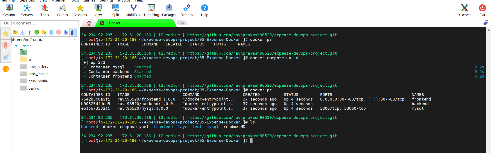

### Verify the Compose application

```bash
curl -I http://localhost/
curl -i http://localhost/api/health
curl -i http://localhost/api/transaction
```

Direct `http://localhost:8080` access is not expected with the repository's Compose file because backend port 8080 is not published. Access it through Nginx or from the Docker network.

Open the website and add another expense. The final screenshot shows the original three entries and a fourth entry, `4000 / recharge`.

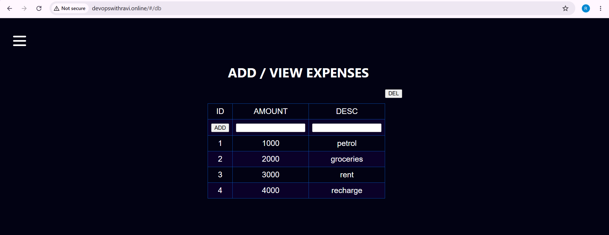

## 9. Lifecycle and Persistence Checks

Useful Compose operations:

```bash
# Follow application logs
docker compose logs -f backend

# Stop and start existing containers
docker compose stop
docker compose start

# Remove Compose containers and its managed network
docker compose down

# Recreate services using the existing external database volume
docker compose up -d
```

To verify persistence yourself, note the rows in the UI or SQL query before `down`, recreate the services, wait for MySQL and the API, and query the rows again. This is a repeatable validation procedure; the screenshots show stored data and the final UI, rather than a complete timestamped teardown/recreation test.

The external `mysql` volume is not deleted by `docker compose down`. Delete it only when you intentionally want to erase the lab database and no container is using it:

```bash
# DESTRUCTIVE: permanently removes the named volume's database data.
# Run only after stopping/removing its containers and taking any needed backup.
docker volume rm mysql
```

## Current Limitations and Improvements

The documented setup reflects the lab and repository configuration. Before using it beyond a learning environment:

- Remove hardcoded database credentials from source, SQL initialization files, and image defaults; configure secure credential delivery and rotate the lab credentials.
- Add meaningful health checks and application-level database retry handling. A fixed sleep is not a readiness check, and Docker health status alone does not automatically restart an unhealthy container.
- Add HTTPS, appropriate restart policies, resource limits, and log rotation.
- Review base-image maintenance and dependency vulnerabilities before rebuilding.
- Back up MySQL and test restoration. A persistent volume alone is insufficient for disaster recovery.
- Review API validation and database error handling before treating successful HTTP responses as proof of successful writes.

## What This Project Demonstrates

- Building, tagging, and distributing three Docker images.
- Running services manually and through Docker Compose.
- Using container DNS and shared networks for service connectivity.
- Publishing the frontend while keeping database traffic internal.
- Storing MySQL data in a reusable named volume.
- Mapping a custom domain to the Docker host using Route 53.
- Diagnosing API routes, container logs, HTTP responses, and database connectivity.
- Verifying expense records in both the browser and MySQL.

## References

- [Project source](https://github.com/raviprakash96520/expense-devops-project/tree/main/05-Expense-Docker)
- [Compose configuration](https://github.com/raviprakash96520/expense-devops-project/blob/main/05-Expense-Docker/docker-compose.yaml)
- [Docker Engine installation on RHEL](https://docs.docker.com/engine/install/rhel/)
- [Docker Compose startup ordering](https://docs.docker.com/compose/how-tos/startup-order/)
- [Docker volumes](https://docs.docker.com/engine/storage/volumes/)

*Screenshots are from the completed lab and preserve its original UI and terminal output. Public addresses and runtime versions shown are historical.*
