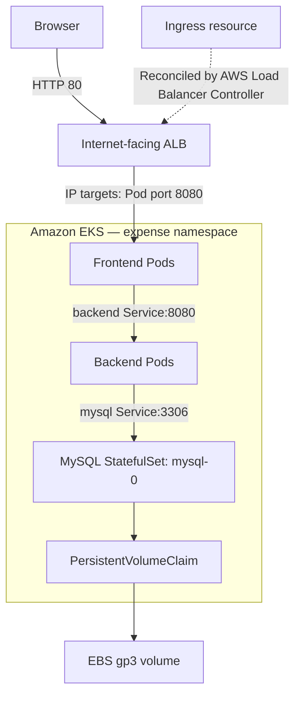
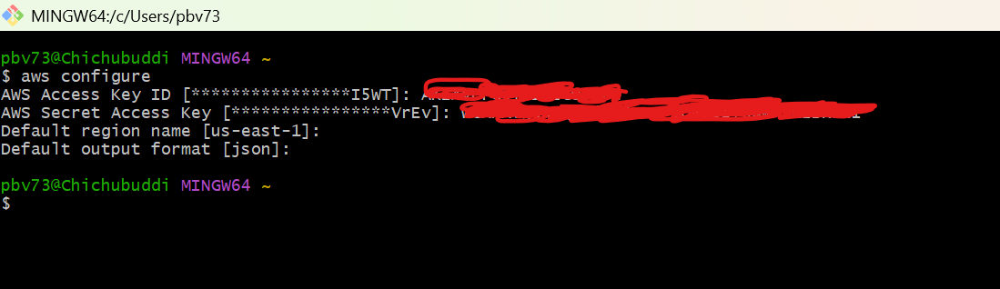
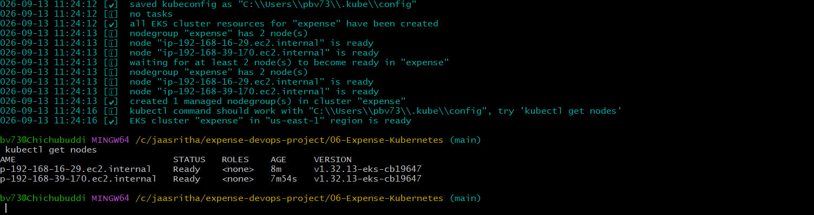
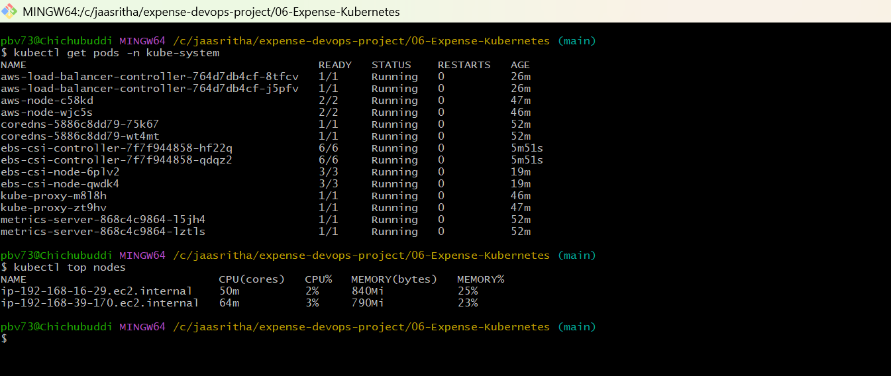
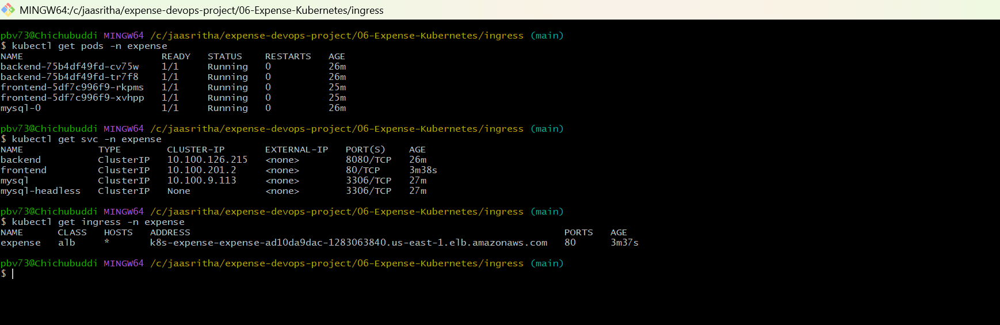
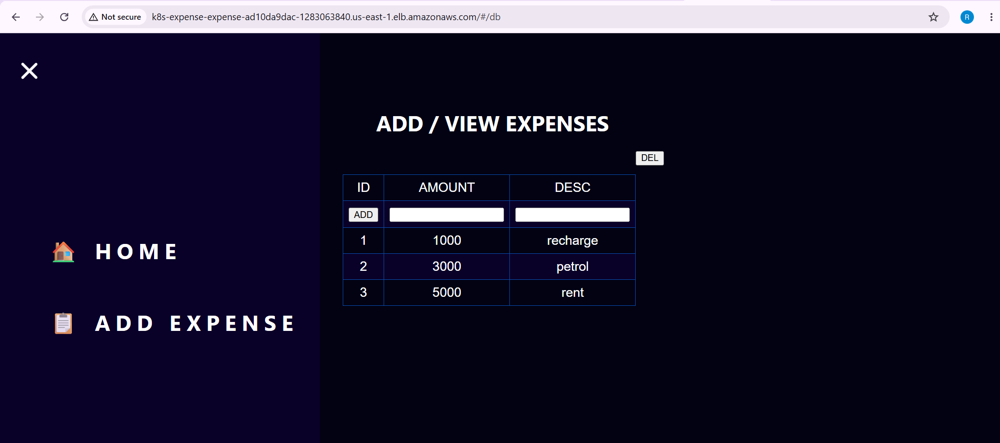
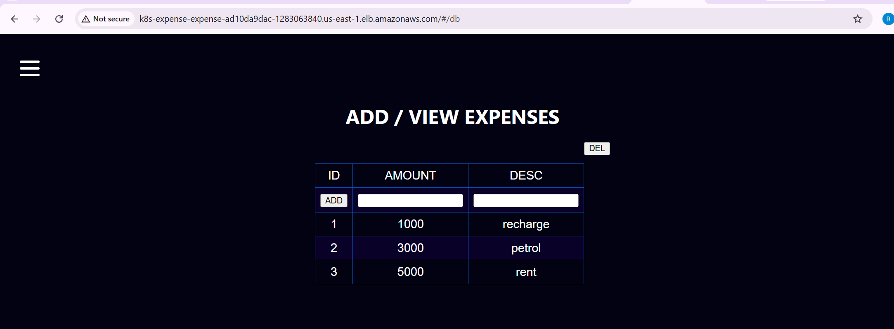

# Expense Application — Kubernetes Deployment on Amazon EKS

## Why Kubernetes? Moving Beyond the Docker Deployment

The [Docker phase](../05-Expense-Docker/) packaged the Expense frontend, backend, and MySQL database into separate images and ran them together on one EC2 host. That established repeatable builds, container networking, and database persistence.

The next goal was to manage those containers across worker nodes and learn how applications behave when deployments, credentials, health checks, or infrastructure fail. Kubernetes provides controllers that continuously reconcile the running application with the desired state declared in YAML.

| Requirement | What Kubernetes adds to this project |
| --- | --- |
| Keep the application running | Deployments and StatefulSets replace missing Pods; kubelet restarts failed containers |
| Run multiple application replicas | Frontend and backend Deployments distribute replicas across available nodes |
| Release changes gradually | Rolling updates, readiness checks, and revision history |
| Reach changing Pods reliably | Services provide stable discovery and route to ready endpoints |
| Scale with application demand | HPA adjusts frontend/backend replicas using CPU metrics |
| Manage database storage | StatefulSet, PVC, StorageClass, and EBS CSI provision persistent storage |
| Control incoming traffic | Ingress provisions an ALB; NetworkPolicies describe allowed Pod ingress |
| Diagnose problems | Events, container logs, termination state, metrics, and rollout status |

Kubernetes still runs container images; it does not replace image building. Amazon EKS manages the Kubernetes control plane, while application containers run on the worker nodes. This lab uses one MySQL replica, so the database is persistent but **not a highly available replicated database**.

## Project Scope and Outcome

This phase deployed the Expense three-tier application using Kubernetes manifests and then used that same application for troubleshooting practice.

The completed workflow covered:

1. Local AWS authentication and EKS creation using `eksctl`.
2. EBS CSI, IAM/OIDC configuration, AWS Load Balancer Controller, and metrics verification.
3. MySQL StatefulSet and EBS-backed storage.
4. Backend/frontend Deployments, Services, probes, resource settings, HPA, and disruption budgets.
5. Public HTTP access through an internet-facing ALB Ingress.
6. Expense creation and persistence after replacing the MySQL Pod.
7. IAM failures, Secret encoding, networking, failed configuration, application crashes, probe failures, rollout history, and memory-restart investigation.

The six screenshots come from the supplied deployment notes. Troubleshooting details below also summarize the terminal output recorded during the project. They are not presented as additional screenshots or as evidence for tests that were not captured. Jenkins, Argo CD, and monitoring are later project phases.

## Architecture



The Ingress references frontend **Service port 80**. The Service's named target port maps to frontend **container port 8080**. With ALB target type `ip`, targets are Pod IPs; the diagram shows that data path. Nginx forwards `/api/` requests to `backend:8080`, and the backend connects to `mysql:3306`.

## Repository Layout

All paths below are relative to [06-Expense-Kubernetes](https://github.com/raviprakash96520/expense-devops-project/tree/main/06-Expense-Kubernetes).

| File | Resources / purpose |
| --- | --- |
| `eks-config.yaml` | EKS cluster and managed node group |
| `01-namespace.yaml` | `expense` namespace |
| `mysql/manifest.yaml` | Namespace, ConfigMap, Secret, StorageClass, two Services, StatefulSet, PVC template |
| `backend/manifest.yaml` | ConfigMap, Service, Deployment, HPA, PDB |
| `frontend/manifest.yaml` | Nginx ConfigMap, Service, Deployment, HPA, PDB |
| `network-policy/manifest.yaml` | Ingress policies for the three tiers |
| `ingress/manifest.yaml` | Internet-facing ALB Ingress |
| `ingress/frontend-configmap-backup.yaml` | Frontend configuration backup used during troubleshooting |

Apply the explicit paths in this guide. A recursive apply of the entire directory can also apply backup files unintentionally. IAM policy JSON files belong to AWS IAM, not `kubectl apply`.

## Resource Design

Images are `ravi96520/mysql:1.0.0`, `ravi96520/backend:1.0.0`, and `ravi96520/frontend:1.0.0`.

| Setting | MySQL | Backend | Frontend |
| --- | --- | --- | --- |
| Workload | StatefulSet | Deployment | Deployment |
| Initial replicas | 1 | 2 | 2 |
| Container port | 3306 | 8080 | 8080 |
| CPU request / limit | 250m / 1 CPU | 100m / 500m | 100m / 500m |
| Memory request / limit | 512Mi / 1Gi | 128Mi / 256Mi | 64Mi / 128Mi |
| Storage | 1Gi EBS PVC | None | ConfigMap mount |
| HPA | None | 2–10 replicas, 70% CPU | 2–10 replicas, 70% CPU |

Backend init-container requests are `50m` CPU and `64Mi` memory, with limits of `250m` and `128Mi`.

Frontend/backend use `maxSurge: 1`, `maxUnavailable: 0`, `minReadySeconds: 10`, and `revisionHistoryLimit: 3`. Their PDBs specify `minAvailable: 1`. PDBs constrain supported voluntary disruptions; they do not prevent application crashes or guarantee availability during every failure.

Topology spread uses hostname with `ScheduleAnyway`: it expresses a placement preference, not a strict guarantee that replicas run on different nodes.

## 1. Configure Local Access

The lab commands were run locally from Windows Git Bash. Bash variables and backslash line continuations below should be run in **Git Bash**, not copied unchanged into PowerShell.

Required tools: AWS CLI, `eksctl`, `kubectl`, Helm, Git, and curl.

```bash
aws configure
aws configure list
aws sts get-caller-identity
```

Use `us-east-1` for this project. Successful STS identity output confirms authentication; it does not by itself establish permission to create every EKS, IAM, or CloudFormation resource.



**Issue encountered:** `InvalidClientTokenId`. The locally configured access-key suffix differed from the IAM key being reviewed. The troubleshooting process checked the active credential source and corrected the credentials before cluster creation. Temporary credentials also require a valid session token.

Do not place AWS access keys or account-specific credentials in the README or repository.

## 2. Create the EKS Cluster

The checked-in cluster configuration uses:

- Cluster and node-group name: `expense`.
- Region: `us-east-1`.
- IAM OIDC enabled.
- Spot instance alternatives: `t3.medium` and `t3a.medium`.
- Desired/minimum nodes: 2; maximum: 3.
- Node root disks: 20GiB gp3.

```bash
git clone https://github.com/raviprakash96520/expense-devops-project.git
cd expense-devops-project/06-Expense-Kubernetes

eksctl create cluster -f eks-config.yaml

aws eks update-kubeconfig --name expense --region us-east-1
kubectl get nodes
kubectl get pods -n kube-system
```

The original creation took approximately 15 minutes. Timing depends on AWS provisioning and capacity. The screenshot records Kubernetes `v1.32.13`; it is historical evidence, not a version recommendation for a new cluster. Select an EKS-supported version and compatible add-ons when recreating the lab.



A node-group maximum of three does not itself enable automatic node scaling. HPA scales Pods, and a node autoscaling mechanism must be configured separately if automatic node growth is required.

## 3. Install and Verify Cluster Add-ons

### Check the existing add-ons

```bash
aws eks list-addons --cluster-name expense --region us-east-1
kubectl get pods -n kube-system
```

The initial cluster reported `coredns`, `kube-proxy`, `metrics-server`, and `vpc-cni`. The VPC CNI Pods are named `aws-node-*`; searching Pod names for `CNI` returned no result because that text was not in their names.

### EBS CSI: fresh installation using IRSA

The lab used IAM Roles for Service Accounts (IRSA). The following creation commands assume the role, add-on, and corresponding eksctl CloudFormation stack do not already exist. For a recreated cluster with retained IAM resources, use the recovery guidance later in this README first.

```bash
eksctl utils associate-iam-oidc-provider \
  --cluster expense --region us-east-1 --approve

eksctl create iamserviceaccount \
  --name ebs-csi-controller-sa \
  --namespace kube-system \
  --cluster expense \
  --region us-east-1 \
  --role-name AmazonEKS_EBS_CSI_DriverRole \
  --role-only \
  --attach-policy-arn arn:aws:iam::aws:policy/service-role/AmazonEBSCSIDriverPolicy \
  --approve

EBS_ROLE_ARN=$(aws iam get-role \
  --role-name AmazonEKS_EBS_CSI_DriverRole \
  --query 'Role.Arn' --output text)
```

If role creation or lookup fails, stop and resolve it before installing the add-on. `--role-only` lets the EKS add-on manage the Kubernetes ServiceAccount.

```bash
eksctl create addon \
  --name aws-ebs-csi-driver \
  --cluster expense \
  --region us-east-1 \
  --service-account-role-arn "$EBS_ROLE_ARN"

aws eks wait addon-active \
  --cluster-name expense \
  --addon-name aws-ebs-csi-driver \
  --region us-east-1

kubectl get pods -n kube-system \
  -l app.kubernetes.io/name=aws-ebs-csi-driver
```

The successful lab controller Pods reported `6/6`, and node Pods reported `3/3`. These numbers mean ready containers / total containers **within each Pod**, not six controller Pods. Container counts depend on the installed driver version and its sidecars.

### AWS Load Balancer Controller: fresh installation

The controller needs its own IAM role and policy. EBS permissions and load-balancer permissions serve different controllers.

Prepare the Helm repository and select a compatible chart version. Record the selected chart version for repeatable installations:

```bash
helm repo add eks https://aws.github.io/eks-charts
helm repo update
helm search repo eks/aws-load-balancer-controller --versions
```

Set `LBC_CHART_VERSION` to the version you selected. The placeholder below must be replaced before execution. Retrieve the IAM policy from the matching controller release rather than an unrelated repository branch:

```bash
LBC_CHART_VERSION='<selected-chart-version>'
LBC_VERSION=$(helm show chart eks/aws-load-balancer-controller \
  --version "$LBC_CHART_VERSION" | awk '/^appVersion:/ {gsub(/"/, "", $2); print $2}')

curl -fL \
  "https://raw.githubusercontent.com/kubernetes-sigs/aws-load-balancer-controller/${LBC_VERSION}/docs/install/iam_policy.json" \
  -o lbc-iam-policy.json

LBC_POLICY_ARN=$(aws iam create-policy \
  --policy-name AWSLoadBalancerControllerIAMPolicy \
  --policy-document file://lbc-iam-policy.json \
  --query 'Policy.Arn' --output text)
```

If that policy already exists, retrieve and review its ARN and policy contents instead of rerunning `create-policy` and ignoring the error.

```bash
eksctl create iamserviceaccount \
  --cluster expense \
  --region us-east-1 \
  --namespace kube-system \
  --name aws-load-balancer-controller \
  --role-name AmazonEKSLoadBalancerControllerRole \
  --attach-policy-arn "$LBC_POLICY_ARN" \
  --approve

VPC_ID=$(aws eks describe-cluster \
  --name expense --region us-east-1 \
  --query 'cluster.resourcesVpcConfig.vpcId' --output text)

helm upgrade --install aws-load-balancer-controller \
  eks/aws-load-balancer-controller \
  --version "$LBC_CHART_VERSION" \
  --namespace kube-system \
  --set clusterName=expense \
  --set serviceAccount.create=false \
  --set serviceAccount.name=aws-load-balancer-controller \
  --set region=us-east-1 \
  --set vpcId="$VPC_ID"

kubectl rollout status deployment/aws-load-balancer-controller \
  -n kube-system --timeout=180s
kubectl get ingressclass alb
```

Public ALB provisioning also depends on suitable public subnets, routing, security groups, and subnet discovery configuration.

### Verify metrics and infrastructure health

```bash
kubectl get pods -n kube-system
kubectl top nodes
kubectl get deployment aws-load-balancer-controller -n kube-system
```



## 4. Deploy the Expense Application

### Namespace and database

```bash
kubectl apply -f 01-namespace.yaml
kubectl apply -f mysql/manifest.yaml

kubectl get pvc -n expense
kubectl get pv
kubectl rollout status statefulset/mysql -n expense --timeout=300s
```

The StorageClass `expense-ebs` uses encrypted gp3 volumes, `WaitForFirstConsumer`, expansion support, and `reclaimPolicy: Retain`. With delayed binding, a PVC may wait until a consuming Pod can be scheduled. EBS volumes are Availability Zone scoped, so placement and attachment must match the volume's topology.

MySQL uses one replica. Simply changing the StatefulSet to two replicas would create two independent database instances; it does not configure MySQL replication.

The headless Service supplies StatefulSet network identity. The normal `mysql` ClusterIP Service is the backend connection endpoint.

### Backend and frontend

```bash
kubectl apply -f backend/manifest.yaml
kubectl apply -f frontend/manifest.yaml

kubectl rollout status deployment/backend -n expense --timeout=300s
kubectl rollout status deployment/frontend -n expense --timeout=300s
```

The backend's `mysql-check` init container waits for authenticated access to the application table. This is stronger than only checking that the database hostname resolves. The init container does not continuously monitor MySQL after the backend starts.

### NetworkPolicies and Ingress

```bash
kubectl apply -f network-policy/manifest.yaml
kubectl apply -f ingress/manifest.yaml

kubectl get pods,svc,ingress -n expense
kubectl get hpa,pdb,networkpolicy -n expense
```

NetworkPolicy enforcement requires a supporting, enabled CNI configuration. Merely applying a policy is not proof that traffic is blocked.

| Selected destination | Allowed ingress in these manifests |
| --- | --- |
| MySQL Pods | Backend-labeled Pods in the same namespace, TCP 3306 |
| Backend Pods | Frontend-labeled Pods in the same namespace, TCP 8080 |
| Frontend Pods | Any source, TCP 8080 |

The frontend policy specifies **8080** because that is the destination Pod's Nginx listening port. Its Service port is 80. A rule without `from` permits all sources on its listed port; this is not an ALB-only source restriction. These policies restrict ingress; they do not restrict egress.



Expected baseline: two frontend Pods, two backend Pods, and one MySQL Pod. HPA can change the application replica counts later.

## 5. Access the Website and Add Expenses

```bash
kubectl get ingress expense -n expense
kubectl describe ingress expense -n expense
```

Open `http://<ingress-address>/` in a browser. The Ingress configures HTTP port 80, an internet-facing ALB, IP targets, and `/health` checks. HTTPS was not part of this captured deployment.

The captured test inserted:

| Amount | Description |
| --- | --- |
| 1000 | recharge |
| 3000 | petrol |
| 5000 | rent |



## 6. Verify MySQL Persistence After Pod Replacement

First confirm application health and record the PVC binding:

```bash
kubectl get pods -n expense
kubectl get pvc -n expense
kubectl logs deployment/backend -n expense -c backend --tail=50
```

For direct data verification, enter MySQL using the configured password at the prompt:

```bash
kubectl exec -it mysql-0 -n expense -- mysql -u root -p
```

```sql
USE transactions;
SELECT id, amount, description FROM transactions;
EXIT;
```

Replace only the database Pod:

```bash
kubectl delete pod mysql-0 -n expense
kubectl get pods -n expense -w
```

The StatefulSet recreates `mysql-0`. Wait for `1/1 Running`, stop the watch with Ctrl+C, and check the rollout and PVC again:

```bash
kubectl rollout status statefulset/mysql -n expense --timeout=300s
kubectl get pvc -n expense
kubectl get pods -n expense
```

Refresh the website. The supplied notes identify the following screenshot as the post-recreation check; the same three expense records remain visible.



The replacement Pod reused its PVC and EBS-backed data. Pod replacement and cluster deletion are different operations: retained EBS storage does not automatically rebind itself to a newly created cluster. `Retain` is also not a backup strategy.

With one database replica, replacement temporarily interrupts database availability. The backend may restart if it cannot handle a lost database connection.

## 7. Troubleshooting the Deployment

### 7.1 EBS controller CrashLoopBackOff: IAM role and OIDC

**Observed:** controller Pods were `1/6 CrashLoopBackOff`, while EBS node Pods remained `3/3 Running`. Logs contained:

```text
AccessDenied: Not authorized to perform sts:AssumeRoleWithWebIdentity
Failed health check ... EC2: DescribeAvailabilityZones ... get credentials
```

The project encountered two separate IAM problems:

- The add-on referenced `AmazonEKS_EBS_CSI_DriverRole`, but `aws iam get-role` returned `NoSuchEntity`.
- After deleting and recreating the cluster, an existing role trusted the **old cluster OIDC issuer**.

Another inspected role trusted `aws-load-balancer-controller` and had its policy attached. It was not the EBS role and should not be repurposed as one.

Diagnosis:

```bash
aws eks describe-cluster --name expense --region us-east-1 \
  --query 'cluster.identity.oidc.issuer' --output text

aws iam get-role --role-name AmazonEKS_EBS_CSI_DriverRole \
  --query 'Role.AssumeRolePolicyDocument' --output json

aws iam list-attached-role-policies \
  --role-name AmazonEKS_EBS_CSI_DriverRole

aws eks describe-addon --cluster-name expense --region us-east-1 \
  --addon-name aws-ebs-csi-driver \
  --query '{Status:addon.status,Role:addon.serviceAccountRoleArn,Issues:addon.health.issues}'

kubectl get sa ebs-csi-controller-sa -n kube-system -o yaml
kubectl logs <controller-pod> -n kube-system -c ebs-plugin --previous --tail=50
```

The role's trust must match all of the following:

| Trust field | Required value |
| --- | --- |
| Federated principal | IAM OIDC provider for the current cluster issuer |
| Action | `sts:AssumeRoleWithWebIdentity` |
| Issuer `:aud` condition | `sts.amazonaws.com` |
| Issuer `:sub` condition | `system:serviceaccount:kube-system:ebs-csi-controller-sa` |

**Resolution:** establish the current cluster OIDC provider, create or correct the dedicated role/trust, attach EBS permissions, and ensure the add-on uses that role. After the IAM correction:

```bash
kubectl rollout restart deployment/ebs-csi-controller -n kube-system
kubectl rollout status deployment/ebs-csi-controller -n kube-system --timeout=180s
```

The controller Pods subsequently reached `6/6 Running` with zero restarts in the recorded check. A restart alone does not correct an IAM trust policy.

**Recreation lesson:** the cluster name can remain `expense` while its OIDC issuer changes. Compare the current issuer every time retained IRSA roles are reused. The load balancer controller's IRSA trust must also match the recreated cluster.

### 7.2 eksctl skipped creation or CloudFormation was ROLLBACK_COMPLETE

Observed messages included `existing iamserviceaccount(s) will be excluded`, `no tasks`, and a failed role stack in `ROLLBACK_COMPLETE`.

```bash
aws cloudformation describe-stack-events \
  --stack-name eksctl-expense-addon-iamserviceaccount-kube-system-ebs-csi-controller-sa \
  --region us-east-1
```

Inspect the failure reason and the actual resources before retrying. Clean up only the failed EBS-specific stack/resources when appropriate, wait for deletion, and then recreate. A manually deleted IAM role can leave an eksctl CloudFormation stack out of sync.

Do not delete the cluster or load balancer controller to fix this EBS-only problem. Do not attach `AmazonEKSLoadBalancingPolicy` to an arbitrary role as a remedy for EBS authentication failures.

### 7.3 MySQL Running but 0/1: Secret encoding mismatch

**Observed:** MySQL readiness failed with:

```text
ERROR 1045 (28000): Access denied for user 'root'@'127.0.0.1'
```

The supplied manifest placed base64-encoded values under `stringData`. Kubernetes treated those characters as the literal password.

| Secret field | What to supply |
| --- | --- |
| `stringData` | Plain string |
| `data` | Base64-encoded representation of the intended string |

Use one representation correctly. The repository's corrected Secret uses `data`. Base64 is encoding, not encryption; do not treat encoded passwords in Git as protected secrets.

Correct the Secret to match the existing database credentials, then replace Pods that consume its values as environment variables. Applying the Secret alone does not update an already running container's environment.

```bash
kubectl apply -f mysql/manifest.yaml
# After confirming the Secret now matches the initialized database:
kubectl delete pod mysql-0 -n expense
kubectl rollout status statefulset/mysql -n expense --timeout=300s
kubectl rollout restart deployment/backend -n expense
kubectl rollout status deployment/backend -n expense --timeout=300s
```

The recorded replacement reached `1/1 Running`, and expenses remained. Changing `MYSQL_ROOT_PASSWORD` on a container is not a password rotation for an initialized database. Do not delete its PVC to resolve a credential mismatch.

### 7.4 Backend ECONNREFUSED while MySQL was unready

Backend logs showed an unhandled connection error to the `mysql` Service on port 3306. MySQL's failed readiness check meant it could not serve as a normal ready endpoint.

```bash
kubectl describe pod mysql-0 -n expense
kubectl get endpointslice -n expense \
  -l kubernetes.io/service-name=mysql
kubectl logs <backend-pod> -n expense -c backend --previous --tail=50
```

Fix the database readiness/credentials first, verify ready endpoints, and then recover the backend. The application should ideally retry transient database failures rather than terminate on an unhandled connection error.

### 7.5 Website timeout: internal NLB

The initial frontend `LoadBalancer` Service received a DNS address, but browser connections timed out. AWS inspection showed the load balancer was `internal` and `network`.

An assigned DNS name does not mean a load balancer is publicly reachable. The project switched to a **ClusterIP frontend Service plus an internet-facing ALB Ingress**, after which the website was accessed successfully.

Useful checks:

```bash
kubectl get svc,ingress -n expense
kubectl describe ingress expense -n expense
kubectl logs deployment/aws-load-balancer-controller -n kube-system --tail=100
aws elbv2 describe-load-balancers --region us-east-1 \
  --query 'LoadBalancers[].{Name:LoadBalancerName,Scheme:Scheme,State:State.Code,Type:Type}'
```

### 7.6 VS Code reported a NetworkPolicy schema error on HPA spec

The editor reported `Missing property "podSelector"` while the displayed object used HPA fields such as `scaleTargetRef`.

That diagnostic indicates a schema/object mismatch; it does not mean an HPA needs `podSelector`. Check document separators, each resource's `apiVersion`/`kind`, and any forced editor schema association. Validate against the cluster:

```bash
kubectl apply --dry-run=server -f backend/manifest.yaml
kubectl apply --dry-run=server -f frontend/manifest.yaml
```

The screenshot alone did not establish whether the cause was a missing separator or an editor schema setting.

## 8. Application Failure Simulations and Interview Lessons

These exercises used the existing Expense workloads. Restore a known-good baseline between exercises so that one failure does not hide another. The initial explicit startup failure was a warm-up; subsequent exercises examined realistic failure categories.

### Baseline checks

```bash
kubectl get pods -n expense
kubectl rollout history deployment/backend -n expense
kubectl get hpa -n expense
```

### A. Application process exits immediately

The failed container's previous logs showed:

```text
ERROR: simulated backend startup failure
```

A container command was intentionally made to fail. Kubernetes restarted the container and progressively delayed repeated retries, producing `CrashLoopBackOff`.

```bash
kubectl logs <failed-pod> -n expense -c backend --previous
kubectl describe pod <failed-pod> -n expense
```

`-c backend` selects the container; this matters because the Pod also has `mysql-check`. `--previous` reads logs from the previous terminated instance of that container in the same Pod. It is not a log archive for an already deleted Pod.

### B. Incorrect database credentials

The backend emitted:

```text
ER_ACCESS_DENIED_ERROR
errno: 1045
Access denied for user 'expense' ... (using password: YES)
```

This means a MySQL server responded and rejected authentication. It differs from a hostname lookup failure, TCP refusal, or network timeout. The Node.js process terminated because the connection error was unhandled.

Restore the correct backend credentials, remove any test environment override, and recreate the backend Pods. If incorrect credentials are also supplied to `mysql-check`, new Pods may remain in the init phase instead of reaching a backend CrashLoop.

A wrong-DB-host exercise was discussed but not confirmed by the supplied output; it is not counted here as a completed simulation.

### C. Invalid Nginx configuration

Frontend logs showed:

```text
unknown directive "invalid_directive" in /etc/nginx/nginx.conf:3
```

The intentionally invalid directive prevented Nginx startup. Recovery restored the valid ConfigMap and recreated frontend Pods:

```bash
kubectl apply -f frontend/manifest.yaml
kubectl rollout restart deployment/frontend -n expense
kubectl rollout status deployment/frontend -n expense --timeout=180s
```

The ConfigMap is mounted using `subPath`, so running containers do not receive automatic updates to that mounted file. Correcting the configuration and replacing Pods are both required.

**Additional issue encountered:** applying an exported backup failed with `the object has been modified`. The backup contained a stale `metadata.resourceVersion`.

For a reusable declarative backup, keep `apiVersion`, `kind`, `metadata.name`, `metadata.namespace`, and the intended configuration. Remove server-generated metadata such as `resourceVersion`, `uid`, `creationTimestamp`, and `managedFields`, and remove stale last-applied annotation content. Then apply the cleaned file. Restarting before that failed apply was fixed simply restarted Pods with the still-invalid configuration.

### D. Incorrect liveness-probe endpoint

Events showed:

```text
Liveness probe failed: HTTP probe failed with statuscode: 404
Container backend failed liveness probe, will be restarted
```

The liveness check targeted an invalid path. After the configured failure threshold, kubelet restarted the container even though the process had been running.

Readiness also temporarily reported `connection refused` on `/health`: during the restart window, the application was not yet listening on port 8080. That readiness error was a consequence of the restart, not proof of a permanently incorrect readiness path.

Restore the backend liveness path to `/health` and verify the new rollout. A rollout **restart** does not remove a bad probe setting; fix the Pod template or use a known-good revision first.

### E. Memory pressure and OOM investigation

The memory exercise discussed intentionally increasing memory consumption and observing a container restart. The shown Events and Pod listing demonstrated a restart and temporary readiness failure, but did not themselves include an `OOMKilled` termination reason.

Verify the actual cause before concluding that a restart was an OOM:

```bash
kubectl get pod <backend-pod> -n expense \
  -o jsonpath='{range .status.containerStatuses[*]}{.name}{" reason="}{.lastState.terminated.reason}{" exit="}{.lastState.terminated.exitCode}{" restarts="}{.restartCount}{"\n"}{end}'

kubectl describe pod <backend-pod> -n expense
kubectl top pods -n expense
```

A confirmed container memory-limit OOM is normally reported as `OOMKilled`, commonly with exit code 137. Exit code 137 alone is not sufficient evidence of an OOM. After a killed process exits, its memory is released; a restarted process begins with a new memory allocation. A persistent memory leak or continuing load can cause the issue again.

### Common recovery procedure

For Deployment-template-only experiments, a verified previous revision can be restored:

```bash
kubectl rollout history deployment/backend -n expense
kubectl rollout undo deployment/backend -n expense --to-revision=<known-good-revision>
kubectl rollout status deployment/backend -n expense --timeout=180s
```

Rollback does not restore separately edited Secrets or ConfigMaps. Restore those first where relevant. Confirm the intended live probe, command, resources, and environment after recovery; remove explicit experimental overrides rather than assuming every apply will remove fields introduced by other tools.

## 9. Kubernetes Concepts Learned from the Incidents

| Concept | Project-specific lesson |
| --- | --- |
| Running vs Ready | A running MySQL process can remain `0/1` when authenticated readiness fails |
| Startup probe | Gives startup time before readiness/liveness checks begin |
| Readiness probe | Controls normal Service endpoint eligibility; failure alone does not restart the container |
| Liveness probe | Repeated failure can restart the container |
| CrashLoopBackOff | Retry backoff is a symptom; inspect process errors, termination state, and Events for the cause |
| Pod vs container restart | A restart can keep the same Pod name/UID; a controller replacement creates a new Pod |
| Resource requests | Used for scheduling and CPU-utilization HPA calculations |
| CPU limits | CPU can be throttled at its limit |
| Memory limits | Exceeding the limit can lead to an OOM kill |
| HPA | CPU percentage is relative to requested CPU, not the CPU limit |
| Secret update | Existing environment variables remain unchanged until containers are recreated |
| Persistent storage | Replacing `mysql-0` preserves data when the PVC/volume is retained |

For a backend CPU request of `100m`, a 70% HPA target corresponds to roughly `70m` usage relative to that request per Pod in the utilization calculation. Scaling still depends on available metrics, readiness, stabilization behavior, and cluster capacity. `kubectl top` shows resource usage, not application-specific business metrics.

### Why revision 3 disappeared

A recorded ReplicaSet listing showed:

| ReplicaSet | Current revision | Previous revisions |
| --- | --- | --- |
| `backend-6db4d9888b` | 2 | None shown |
| `backend-75b4df49fd` | 5 | 1,3 |
| `backend-94f7c7bc8` | 4 | None shown |

The controller reused a matching ReplicaSet and advanced its revision to 5. That same ReplicaSet had previously represented revisions **1 and 3**. A revision is rollout metadata, not a permanently unique ReplicaSet. Separately, old ReplicaSets can be cleaned up according to `revisionHistoryLimit`.

A Pod seen as `Terminating` during a rollout may already be deleted by the time `kubectl describe` runs, producing `NotFound`. Inspect the current replacement Pod rather than repeatedly querying the deleted name.

## 10. Final Verification

```bash
kubectl get nodes
kubectl get pods -n kube-system
kubectl get pods,svc,ingress,pvc -n expense
kubectl get hpa,pdb,networkpolicy -n expense
kubectl top nodes
kubectl top pods -n expense

kubectl rollout status statefulset/mysql -n expense --timeout=180s
kubectl rollout status deployment/backend -n expense --timeout=180s
kubectl rollout status deployment/frontend -n expense --timeout=180s
```

Verify browser access, add an expense, refresh, and compare with a database query. API health alone does not prove that expense writes have succeeded.

## 11. Cleanup and Recreating the Lab

Delete application traffic resources while the load balancer controller is still running, and allow it to remove the AWS load balancer:

```bash
kubectl delete -f ingress/manifest.yaml
```

Confirm AWS load-balancer deletion before deleting the cluster. Back up database data first if it is needed.

```bash
eksctl delete cluster --name expense --region us-east-1
```

Inspect retained EBS volumes, snapshots, IAM resources, and any remaining AWS networking resources. The StorageClass uses `Retain`, so storage may remain and continue to incur charges. Do not assume deleting the Kubernetes cluster removes every resource or preserves enough metadata for automatic database recovery.

When rebuilding, recheck IAM trust against the new OIDC issuer and review eksctl stack state. Fresh-creation commands are not guaranteed to be idempotent against stale stacks or retained role names.

## Improvements Beyond This Lab

- Replace committed lab credentials and use secure secret delivery; base64 is not protection.
- Add HTTPS and appropriate access restrictions for external traffic.
- Confirm NetworkPolicy enforcement with explicit allowed/denied traffic tests.
- Add database backups and tested restoration; evaluate managed or replicated database availability separately.
- Improve backend database reconnection, validation, and error handling.
- Review supported Kubernetes/add-on/image versions before recreating the environment.
- Add node autoscaling and broader monitoring as separate, validated changes.

## References

- [Project manifests](https://github.com/raviprakash96520/expense-devops-project/tree/main/06-Expense-Kubernetes)
- [Previous Docker phase](../05-Expense-Docker/)
- [Kubernetes probes](https://kubernetes.io/docs/concepts/configuration/liveness-readiness-startup-probes/)
- [StatefulSets](https://kubernetes.io/docs/concepts/workloads/controllers/statefulset/)
- [NetworkPolicies](https://kubernetes.io/docs/concepts/services-networking/network-policies/)
- [Horizontal Pod Autoscaling](https://kubernetes.io/docs/tasks/run-application/horizontal-pod-autoscale/)
- [EBS CSI on EKS](https://docs.aws.amazon.com/eks/latest/userguide/ebs-csi.html)
- [AWS Load Balancer Controller](https://kubernetes-sigs.github.io/aws-load-balancer-controller/)

*Screenshots preserve the original lab output. Cluster addresses, Pod names, and displayed versions are historical and will differ in a new environment.*
