# Expense Application – Jenkins CI, Argo CD GitOps, EKS & Observability

This folder documents the **end-to-end DevSecOps implementation of the Expense 3-tier application** using Jenkins for Continuous Integration, Amazon ECR for container images, Argo CD for GitOps-based Continuous Deployment, Amazon EKS for Kubernetes, Prometheus/Grafana for metrics, and the Elastic stack for centralized logs.

> **Execution proof:** The screenshots captured during the actual implementation are placed directly under the corresponding setup/validation step throughout this README.

> **Application:** Expense 3-Tier Application  
> **CI:** Jenkins  
> **CD:** Argo CD (GitOps)  
> **Container Registry:** Amazon ECR  
> **Kubernetes:** Amazon EKS  
> **Monitoring:** Prometheus + Grafana  
> **Logging:** Filebeat + Elasticsearch + Kibana using ECK  
> **Security Scanning:** GitLeaks, Snyk, SonarQube, Checkov, Syft, Trivy

---

## Why CI/CD and Why Jenkins?

Before CI/CD, every change would require several manual steps: pull code, scan it, build Docker images, tag them, push them to a registry, update deployment manifests, deploy the application, verify the result, and notify the team. Doing this manually is slow, repetitive, and error-prone.

In this project, **CI and CD are deliberately separated**:

- **Jenkins handles CI** and the GitOps hand-off.
- **Argo CD handles CD** and deploys the desired state from Git to EKS.

Jenkins was used because it can orchestrate the complete CI workflow as code and integrate with source control, security scanners, SonarQube, Docker, AWS ECR, Git, and email notifications.

The important design decision is that **Jenkins does not directly deploy application workloads to EKS**. After building and pushing a new image, Jenkins updates `values-dev.yaml` in Git. Argo CD detects that Git change and synchronizes it to the EKS cluster.

```text
Developer Push
     |
     v
   GitHub
     |
     v
   Jenkins
     |
     +--> GitLeaks
     +--> Snyk
     +--> SonarQube + Quality Gate
     +--> Checkov
     +--> Docker Build
     +--> Syft SBOM
     +--> Trivy
     +--> Push Images to Amazon ECR
     +--> Update Helm values-dev.yaml in Git
                               |
                               v
                            Argo CD
                               |
                               v
                            Amazon EKS
                               |
                    +----------+----------+
                    |                     |
                    v                     v
             Prometheus/Grafana     Filebeat/Elastic/Kibana
```

This gives a clear responsibility split:

| Area | Tool | Responsibility |
|---|---|---|
| Source Control | GitHub | Application, Jenkins and Helm source |
| CI Orchestration | Jenkins | Build, scan, publish and GitOps update |
| Secrets Scan | GitLeaks | Detect accidental secrets in source |
| Dependency Scan | Snyk | Scan application dependencies |
| SAST / Code Quality | SonarQube | Static analysis and Quality Gate |
| IaC / Helm Scan | Checkov | Scan Helm/Kubernetes configuration |
| Container Build | Docker | Build backend and frontend images |
| SBOM | Syft | Generate CycloneDX software bill of materials |
| Image Scan | Trivy | Scan container images for vulnerabilities |
| Registry | Amazon ECR | Store versioned Docker images |
| CD / GitOps | Argo CD | Synchronize Git desired state to EKS |
| Kubernetes | Amazon EKS | Run the Expense application |
| Metrics | Prometheus | Collect Kubernetes/node/pod metrics |
| Visualization | Grafana | Visualize metrics |
| Log Shipping | Filebeat | Collect container logs from every node |
| Log Storage/Search | Elasticsearch | Store and index logs |
| Log UI | Kibana | Search and analyze logs |

---

## Table of Contents

1. [Project Architecture](#project-architecture)
2. [Important Repository Paths](#important-repository-paths)
3. [Phase 1 - Jenkins Infrastructure](#phase-1---jenkins-infrastructure)
4. [Phase 2 - Jenkins Configuration](#phase-2---jenkins-configuration)
5. [Phase 3 - DevSecOps Pipeline](#phase-3---devsecops-pipeline)
6. [Phase 4 - Amazon EKS](#phase-4---amazon-eks)
7. [Phase 5 - AWS Load Balancer Controller](#phase-5---aws-load-balancer-controller)
8. [Phase 6 - Argo CD GitOps](#phase-6---argo-cd-gitops)
9. [Phase 7 - Monitoring](#phase-7---monitoring)
10. [Phase 8 - Centralized Logging](#phase-8---centralized-logging)
11. [Validation](#validation)
12. [Troubleshooting Performed](#troubleshooting-performed)
13. [Cleanup](#cleanup)
14. [Interview Explanation](#interview-explanation)

---

# Project Architecture

```text
                                  GitHub
                    Source Code + Helm + Jenkinsfile
                                      |
                                      v
                         +-------------------------+
                         |     Jenkins Server      |
                         |      Controller         |
                         +------------+------------+
                                      |
                                      | executes jobs on
                                      v
                         +-------------------------+
                         |      Jenkins Agent      |
                         | Docker / AWS CLI /      |
                         | scanners / build tools  |
                         +------------+------------+
                                      |
            +-------------------------+-------------------------+
            |                         |                         |
            v                         v                         v
       SonarQube                 Amazon ECR                  GitHub
      SAST/Quality          backend/frontend images      values-dev.yaml
                                                               |
                                                               v
                                                            Argo CD
                                                               |
                                                               v
                                                          Amazon EKS
                                                               |
                                      +------------------------+------------------------+
                                      |                        |                        |
                                      v                        v                        v
                                  Frontend                  Backend                  MySQL
                                      |                        |                        |
                                      +------------------------+------------------------+
                                                               |
                        +--------------------------------------+--------------------------------+
                        |                                                                       |
                        v                                                                       v
               Prometheus + Grafana                                                Filebeat -> Elasticsearch
                       Metrics                                                            -> Kibana
```

---

# Important Repository Paths

The project uses these important paths under `07-Expense-Jenkins`:

```text
07-Expense-Jenkins/
├── backend-CI/                 # Backend build context used by Jenkins
├── frontend/                   # Frontend build context used by Jenkins
├── helm/                       # Helm chart used by Argo CD
│   └── values-dev.yaml         # Image versions updated by Jenkins
├── observability/              # Monitoring/logging related values/manifests
├── Jenkinsfile                 # CI/DevSecOps pipeline
├── argocd-application.yaml     # Declarative Argo CD application
└── install-tools.sh            # Jenkins agent tool installation script
```

> The exact repository may contain additional files. The paths above are the ones used directly by this project flow.

Repository:

```text
https://github.com/raviprakash96520/expense-devops-project
```

---

# Phase 1 - Jenkins Infrastructure

## 1. Create Three EC2 Instances

Three EC2 instances were used:

1. `Jenkins`
2. `Jenkins-agent`
3. `SonarQube`

The screenshot below shows the three EC2 instances used for the Jenkins controller, Jenkins agent, and SonarQube server.

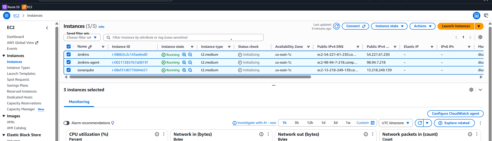

*Three EC2 instances used for the project: Jenkins controller, Jenkins agent, and SonarQube.*

For a lab environment, allow only the ports that are required from trusted source IPs:

| Component | Port | Purpose |
|---|---:|---|
| SSH | 22 | Administration |
| Jenkins | 8080 | Jenkins UI |
| SonarQube | 9000 | SonarQube UI/API |

> Do not expose Jenkins or SonarQube to the entire internet in a production environment.

---

## 2. Install Jenkins on the Jenkins EC2 Instance

The Jenkins controller used Java 21. On RHEL/Rocky/compatible distributions:

```bash
sudo dnf install -y wget fontconfig java-21-openjdk

sudo wget -O /etc/yum.repos.d/jenkins.repo \
  https://pkg.jenkins.io/rpm-stable/jenkins.repo

sudo dnf install -y jenkins
sudo systemctl daemon-reload
sudo systemctl enable --now jenkins
sudo systemctl status jenkins
```

Retrieve the initial administrator password when required:

```bash
sudo cat /var/lib/jenkins/secrets/initialAdminPassword
```

Access Jenkins:

```text
http://<JENKINS_PUBLIC_IP>:8080
```

The completed Jenkins service is shown below.

The screenshot below verifies that the Jenkins service is active and running on the Jenkins EC2 instance.

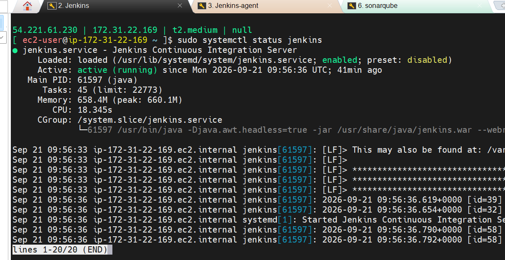

*Jenkins service running successfully on the Jenkins EC2 instance.*

---

## 3. Prepare the Jenkins Agent

The Jenkins agent performs the actual CI work. The project used an `install-tools.sh` script to prepare the agent.

```bash
chmod +x install-tools.sh
sudo ./install-tools.sh
```

The Jenkins agent must contain the tools required by the pipeline. Validate them after installation:

```bash
java -version
git --version
docker --version
aws --version
node --version
npm --version
sonar-scanner --version
gitleaks version
snyk --version
checkov --version
syft version
trivy --version
```

The project used **Java 21** on the Jenkins agent to match the Jenkins controller and avoid Java class-version mismatch errors.

The SonarScanner used during troubleshooting was installed under `/opt/sonar-scanner`, and Syft was installed with:

```bash
curl -sSfL https://get.anchore.io/syft | sudo sh -s -- -b /usr/local/bin
```

The Trivy HTML report template was made available at:

```text
/usr/local/share/trivy/templates/html.tpl
```

The agent tool validation is shown below.

The screenshot below shows the Jenkins agent after the required CI/CD and security tools were installed and validated.

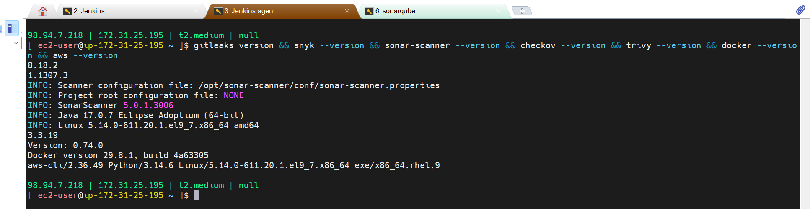

*Validation of the CI/DevSecOps tools installed on the Jenkins agent by `install-tools.sh`.*

### Docker Permissions on the Agent

Jenkins must be able to use the Docker daemon:

```bash
sudo systemctl enable --now docker
sudo usermod -aG docker <AGENT_USER>
```

Log out and log back in after changing group membership.

### Agent Disk Space

Container builds, scanner databases, SBOM files and Docker layers consume significant disk space. During this project, LVM/XFS storage was expanded when disk space became constrained.

Useful checks:

```bash
df -h
lsblk
sudo pvs
sudo vgs
sudo lvs
```

Example expansion used during troubleshooting:

```bash
sudo lvextend -r -L +8G /dev/mapper/RootVG-varVol
```

Always confirm the correct logical volume before extending it.

---

## 4. Run SonarQube in Docker

Install and start Docker on the SonarQube EC2 instance, then run SonarQube.

A simple lab deployment can be started with:

```bash
sudo systemctl enable --now docker

docker volume create sonarqube_data
docker volume create sonarqube_extensions
docker volume create sonarqube_logs

docker run -d \
  --name sonarqube \
  --restart unless-stopped \
  -p 9000:9000 \
  -v sonarqube_data:/opt/sonarqube/data \
  -v sonarqube_extensions:/opt/sonarqube/extensions \
  -v sonarqube_logs:/opt/sonarqube/logs \
  sonarqube:lts-community
```

Verify:

```bash
docker ps
docker logs -f sonarqube
```

The screenshot below shows SonarQube running successfully as a Docker container and exposed on port `9000`.

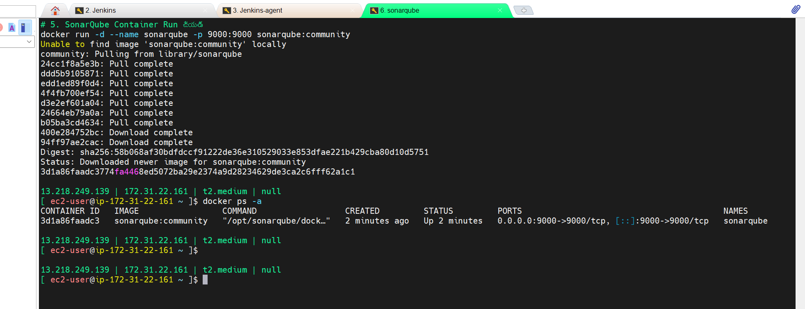

*SonarQube running as a Docker container and exposing port `9000`.*

Access:

```text
http://<SONARQUBE_PUBLIC_IP>:9000
```

> For production, use a supported external database and production-grade persistence rather than treating this lab command as a production deployment.

---

# Phase 2 - Jenkins Configuration

## 5. Add the Jenkins Agent

In Jenkins:

```text
Manage Jenkins
  -> Nodes
  -> New Node
```

Create the agent and configure:

```text
Remote root directory: /home/<agent-user>/jenkins
Labels: agent-1
Launch method: SSH
Host: <JENKINS_AGENT_PRIVATE_IP>
Credentials: SSH private-key credentials
```

After configuration, confirm the node is online.

The screenshot below confirms that the Jenkins agent node is connected and available to execute pipeline jobs.

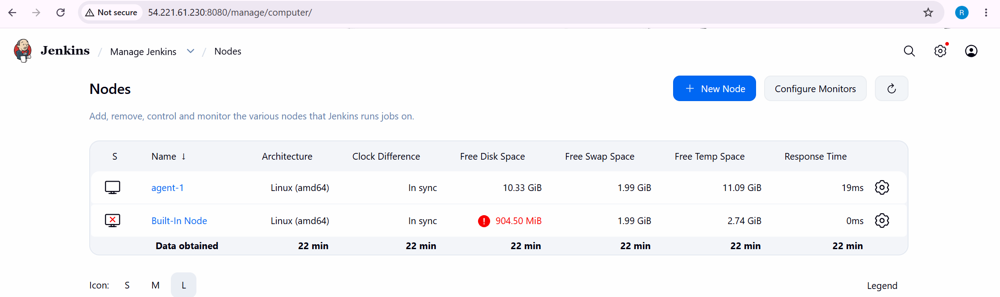

*The Jenkins agent node is registered with the controller and available for pipeline execution.*

---

## 6. Install Jenkins Plugins

The following plugins were used in the project:

```text
1. SonarQube Scanner
2. NodeJS
3. Docker Pipeline
4. AWS Credentials
5. OWASP Dependency-Check
6. HTML Publisher
7. Email Extension
```

Also ensure the normal Pipeline/Git/Credentials plugins required by Jenkins are available.

Install them from:

```text
Manage Jenkins -> Plugins -> Available Plugins
```

---

## 7. Configure Jenkins Credentials

The pipeline requires credentials for GitHub, AWS, Snyk and SonarQube.

Recommended Jenkins credential IDs used by the pipeline are:

| Credential | Jenkins ID | Type |
|---|---|---|
| GitHub | `github-credentials-id` | Username/Password or token-based credential |
| AWS | `aws-ecr-credentials` | AWS access credential for this lab, or preferably an IAM role |
| Snyk | `snyk-api-token` | Secret text |
| SonarQube | `sonar-token` / configured Sonar credential | Secret text |
| Gmail SMTP | project SMTP credential | Username/App Password |

Never commit these values into the repository.

The screenshot below shows the Jenkins credentials configured for GitHub, AWS, SonarQube, Snyk, and email-related integrations.

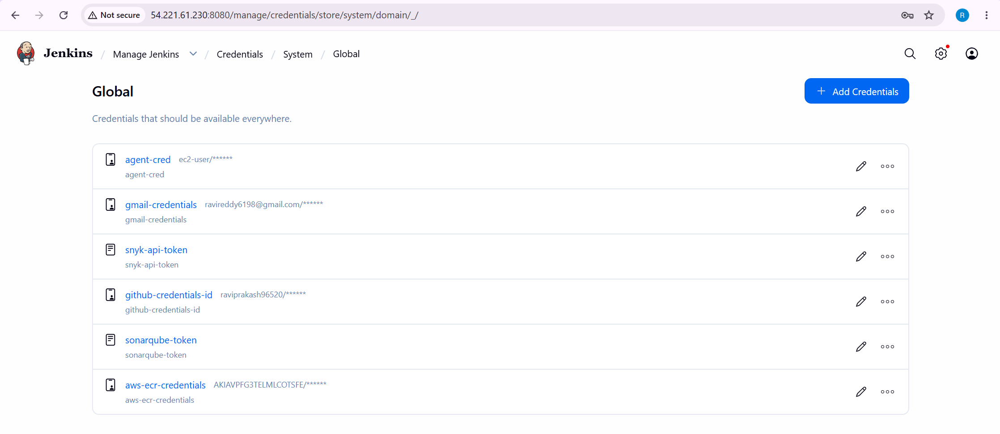

*Jenkins credentials configured for GitHub, AWS, SonarQube, Snyk, and email integration.*

---

## 8. Configure SonarQube Token and Jenkins Integration

### Create SonarQube Token

In SonarQube:

```text
My Account -> Security -> Generate Token
```

Example token name:

```text
jenkins-sonar-token
```

Store the token in Jenkins as **Secret text**.

### Configure SonarQube Server in Jenkins

```text
Manage Jenkins -> System -> SonarQube servers
```

Configure:

```text
Name: SonarQube
Server URL: http://<SONARQUBE_IP>:9000
Authentication Token: <SonarQube Jenkins credential>
```

### Configure SonarScanner

```text
Manage Jenkins -> Tools -> SonarQube Scanner
```

The agent was upgraded to SonarScanner CLI `8.1.0.6389` during troubleshooting.

### Configure SonarQube Webhook

In SonarQube:

```text
Administration -> Configuration -> Webhooks
```

Create:

```text
Name: Jenkins-Webhook
URL: http://<JENKINS_PUBLIC_IP>:8080/sonarqube-webhook/
```

This webhook allows Jenkins `waitForQualityGate()` to receive the Quality Gate result.

---

## 9. Configure Email Notifications

A Gmail App Password was stored securely in Jenkins Credentials.

Configure Jenkins:

```text
Manage Jenkins -> System
```

For SMTP:

```text
SMTP server: smtp.gmail.com
Port: 465
SSL: enabled
Authentication: Jenkins SMTP credential
```

Send a test email before running the final pipeline.

---

# Phase 3 - DevSecOps Pipeline

## 10. Jenkins Pipeline Flow

The final CI pipeline performs the following functional stages:

```text
1. Checkout Code
2. Secrets Scan - GitLeaks
3. Dependency Scan - Snyk
4. SAST Scan - SonarQube
5. SonarQube Quality Gate
6. IaC / Helm Scan - Checkov
7. Docker Build Images
8. Generate SBOM - Syft
9. Container Scan - Trivy
10. Push Images to AWS ECR
11. Update Helm values-dev.yaml for ArgoCD
12. Archive reports / send email notification
```

The final successful Jenkins execution is shown below.

The screenshot below shows the successful Jenkins DevSecOps pipeline with the security, build, ECR, and GitOps update stages completed.

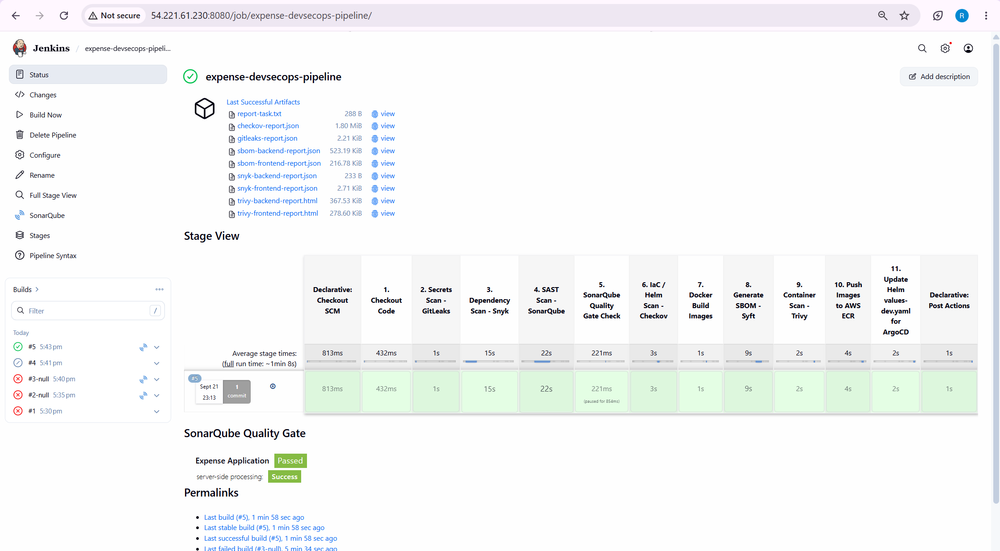

*Successful Jenkins pipeline showing the configured CI/DevSecOps stages and SonarQube Quality Gate result.*

The build archived security reports such as:

```text
gitleaks-report.json
snyk-backend-report.json
snyk-frontend-report.json
checkov-report.json
sbom-backend-report.json
sbom-frontend-report.json
trivy-backend-report.html
trivy-frontend-report.html
```

---

## 11. Pipeline Stage Details

### Stage 1 - Checkout Code

Jenkins checks out the repository and creates a unique image tag from the Git commit.

Example:

```bash
git rev-parse HEAD
git rev-parse --short=5 HEAD
```

Using a commit-derived tag gives traceability between:

```text
Git commit -> Docker image -> Helm values -> Kubernetes deployment
```

---

### Stage 2 - GitLeaks Secret Scan

```bash
gitleaks detect \
  --source=. \
  --report-format=json \
  --report-path=gitleaks-report.json \
  --verbose
```

The project intentionally used report-oriented scanning while building the lab, so security findings could be reviewed without stopping every experimental run.

---

### Stage 3 - Snyk Dependency Scan

Backend:

```bash
cd 07-Expense-Jenkins/backend-CI
snyk test --json > "$WORKSPACE/snyk-backend-report.json"
```

Frontend:

```bash
cd 07-Expense-Jenkins/frontend
snyk test --json > "$WORKSPACE/snyk-frontend-report.json"
```

---

### Stage 4 - SonarQube SAST

```bash
sonar-scanner \
  -Dsonar.projectKey=expense-app \
  -Dsonar.projectName="Expense Application" \
  -Dsonar.sources="07-Expense-Jenkins/backend-CI,07-Expense-Jenkins/frontend"
```

---

### Stage 5 - SonarQube Quality Gate

Jenkins waits for the SonarQube webhook result with `waitForQualityGate()`.

During the completed run, the Quality Gate passed successfully.

---

### Stage 6 - Checkov Helm/IaC Scan

```bash
checkov \
  -d 07-Expense-Jenkins/helm \
  -o json \
  --soft-fail \
  > checkov-report.json
```

---

### Stage 7 - Docker Build

Backend and frontend images are built from their respective directories.

```text
07-Expense-Jenkins/backend-CI
07-Expense-Jenkins/frontend
```

The image names used by the pipeline are:

```text
expense-backend
expense-frontend
```

---

### Stage 8 - Generate SBOM with Syft

Backend:

```bash
syft "$ECR_REGISTRY/expense-backend:$IMAGE_TAG" \
  -o cyclonedx-json=sbom-backend-report.json
```

Frontend:

```bash
syft "$ECR_REGISTRY/expense-frontend:$IMAGE_TAG" \
  -o cyclonedx-json=sbom-frontend-report.json
```

---

### Stage 9 - Trivy Container Scan

Backend:

```bash
trivy image \
  --format template \
  --template "@/usr/local/share/trivy/templates/html.tpl" \
  -o trivy-backend-report.html \
  "$ECR_REGISTRY/expense-backend:$IMAGE_TAG"
```

Frontend:

```bash
trivy image \
  --format template \
  --template "@/usr/local/share/trivy/templates/html.tpl" \
  -o trivy-frontend-report.html \
  "$ECR_REGISTRY/expense-frontend:$IMAGE_TAG"
```

---

### Stage 10 - Push Images to Amazon ECR

Authenticate:

```bash
aws ecr get-login-password --region us-east-1 | \
docker login --username AWS --password-stdin "$ECR_REGISTRY"
```

Push:

```bash
docker push "$ECR_REGISTRY/expense-backend:$IMAGE_TAG"
docker push "$ECR_REGISTRY/expense-frontend:$IMAGE_TAG"
```

> Prefer an IAM role attached to the Jenkins agent instead of long-lived AWS access keys in a production environment.

---

### Stage 11 - Update `values-dev.yaml`

After the ECR push, Jenkins updates the Helm image versions in:

```text
07-Expense-Jenkins/helm/values-dev.yaml
```

Then Jenkins commits and pushes the Git change:

```bash
git add values-dev.yaml
git commit -m "chore(cd): deploy $IMAGE_TAG [skip ci]"
git push origin main
```

This Git commit is the hand-off from **CI to CD**.

```text
Jenkins CI
   |
   | Push image
   v
Amazon ECR
   |
   | Update values-dev.yaml in Git
   v
GitHub
   |
   | Argo CD detects change
   v
Argo CD
   |
   v
EKS
```

---

## 12. Email Notification

After a successful build Jenkins sends an HTML email containing build details and the generated security reports.

The screenshot below shows the build success email generated by Jenkins after pipeline completion.

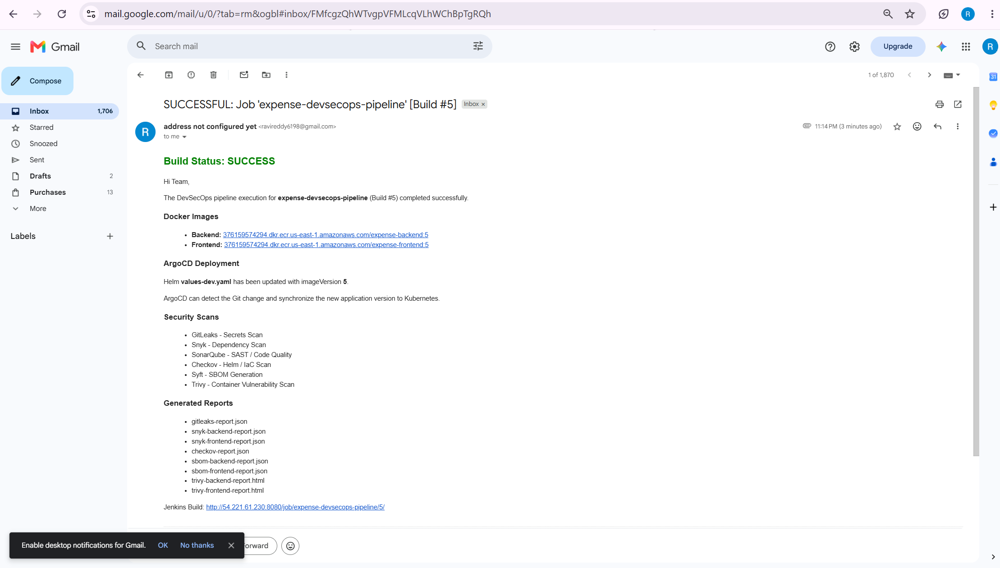

*HTML email notification sent by Jenkins after the successful pipeline execution.*

---

# Phase 4 - Amazon EKS

## 13. EKS Cluster Configuration

The cluster was created using `eksctl` and a `ClusterConfig` file.

Initial configuration:

```yaml
apiVersion: eksctl.io/v1alpha5
kind: ClusterConfig

metadata:
  name: expense
  region: us-east-1

iam:
  withOIDC: true

managedNodeGroups:
  - name: expense
    instanceTypes:
      - t3.medium
      - t3a.medium

    desiredCapacity: 2
    minSize: 2
    maxSize: 3

    spot: true

    volumeSize: 20
    volumeType: gp3

    labels:
      project: expense
      role: worker
```

Create the cluster:

```bash
eksctl create cluster -f cluster.yaml
```

Verify:

```bash
kubectl get nodes
aws eks list-addons --cluster-name expense --region us-east-1
```

### Capacity Adjustment for the Full Observability Stack

The application plus Argo CD, Prometheus/Grafana and Elastic stack required more capacity than the initial nodes provided. The node group was later scaled to four nodes:

```bash
eksctl scale nodegroup \
  --cluster expense \
  --name expense \
  --nodes 4 \
  --nodes-min 2 \
  --nodes-max 4 \
  --wait
```

For future recreation of the complete stack, update the stored cluster configuration accordingly if four nodes are required.

---

## 14. Associate the IAM OIDC Provider

```bash
eksctl utils associate-iam-oidc-provider \
  --cluster expense \
  --region us-east-1 \
  --approve
```

OIDC is required for IAM Roles for Service Accounts (IRSA), which is used by components such as the EBS CSI driver and AWS Load Balancer Controller.

---

## 15. Install the Amazon EBS CSI Driver

Create the EBS CSI IAM role/service-account association:

```bash
eksctl create iamserviceaccount \
  --name ebs-csi-controller-sa \
  --namespace kube-system \
  --cluster expense \
  --region us-east-1 \
  --role-name AmazonEKS_EBS_CSI_DriverRole \
  --attach-policy-arn arn:aws:iam::aws:policy/service-role/AmazonEBSCSIDriverPolicy \
  --role-only \
  --approve
```

Get the role ARN:

```bash
AWS_ACCOUNT_ID=$(aws sts get-caller-identity --query Account --output text)
EBS_ROLE_ARN="arn:aws:iam::${AWS_ACCOUNT_ID}:role/AmazonEKS_EBS_CSI_DriverRole"
```

Create the EKS add-on:

```bash
aws eks create-addon \
  --cluster-name expense \
  --addon-name aws-ebs-csi-driver \
  --service-account-role-arn "$EBS_ROLE_ARN" \
  --region us-east-1
```

Verify:

```bash
aws eks describe-addon \
  --cluster-name expense \
  --addon-name aws-ebs-csi-driver \
  --region us-east-1 \
  --query 'addon.status'

kubectl get pods -n kube-system | grep ebs
```

Expected controller and node pods should be `Running`.

---

## 16. StorageClass for EBS

The logging stack uses a StorageClass named `ebs-aws`.

```yaml
apiVersion: storage.k8s.io/v1
kind: StorageClass
metadata:
  name: ebs-aws
provisioner: ebs.csi.aws.com
reclaimPolicy: Delete
volumeBindingMode: WaitForFirstConsumer
parameters:
  type: gp3
```

Apply:

```bash
kubectl apply -f observability/storageclass.yaml
```

Verify:

```bash
kubectl get storageclass
```

---

# Phase 5 - AWS Load Balancer Controller

## 17. Create IAM Policy and Service Account

Associate OIDC first, then create the AWS Load Balancer Controller IAM policy using the AWS-provided policy JSON for the controller version being installed.

Example flow:

```bash
AWS_ACCOUNT_ID=$(aws sts get-caller-identity --query Account --output text)

aws iam create-policy \
  --policy-name AWSLoadBalancerControllerIAMPolicy \
  --policy-document file://iam_policy.json
```

Create the service account:

```bash
eksctl create iamserviceaccount \
  --cluster expense \
  --namespace kube-system \
  --name aws-load-balancer-controller \
  --role-name AmazonEKSLoadBalancerControllerRole \
  --attach-policy-arn arn:aws:iam::${AWS_ACCOUNT_ID}:policy/AWSLoadBalancerControllerIAMPolicy \
  --override-existing-serviceaccounts \
  --region us-east-1 \
  --approve
```

Install the controller with Helm:

```bash
helm repo add eks https://aws.github.io/eks-charts
helm repo update

VPC_ID=$(aws eks describe-cluster \
  --name expense \
  --region us-east-1 \
  --query 'cluster.resourcesVpcConfig.vpcId' \
  --output text)

helm upgrade --install aws-load-balancer-controller eks/aws-load-balancer-controller \
  -n kube-system \
  --set clusterName=expense \
  --set serviceAccount.create=false \
  --set serviceAccount.name=aws-load-balancer-controller \
  --set region=us-east-1 \
  --set vpcId="$VPC_ID"
```

Verify:

```bash
kubectl get deployment -n kube-system aws-load-balancer-controller
kubectl get pods -n kube-system | grep load-balancer
```

---

# Phase 6 - Argo CD GitOps

## 18. Install Argo CD with Helm

Add the Argo Helm repository:

```bash
helm repo add argo https://argoproj.github.io/argo-helm
helm repo update
```

Download the chart values used in this project:

```bash
helm show values argo/argo-cd --version 9.4.0 \
  > argocd-values-9.4.0.yaml
```

Modify the values file.

### Run Argo CD Internally in Insecure Mode

When TLS is terminated at the external ingress/load balancer, set:

```yaml
configs:
  params:
    create: true
    server.insecure: true
```

### Allow Kustomize to Render Helm

```yaml
configs:
  cm:
    create: true
    kustomize.buildOptions: "--enable-helm"
```

Install:

```bash
helm install argo-cd argo/argo-cd \
  -n argocd \
  -f argocd-values-9.4.0.yaml \
  --version 9.4.0 \
  --create-namespace
```

Verify:

```bash
kubectl get pods -n argocd
kubectl get svc -n argocd
```

Argo CD immediately after installation:

After Argo CD installation, the UI was accessed successfully. The screenshot below shows Argo CD before the Expense application was created.

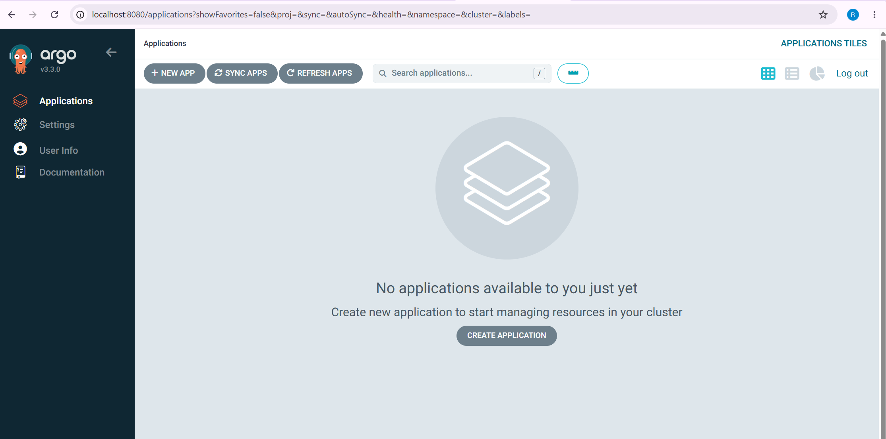

*Argo CD UI after installation, before creating the Expense application.*

---

## 19. Create the Argo CD Application Declaratively

The application is created with YAML, not manually through the UI.

`argocd-application.yaml`:

```yaml
apiVersion: argoproj.io/v1alpha1
kind: Application
metadata:
  name: expense
  namespace: argocd
spec:
  project: default

  source:
    repoURL: https://github.com/raviprakash96520/expense-devops-project.git
    targetRevision: main
    path: 07-Expense-Jenkins/helm
    helm:
      releaseName: expense
      valueFiles:
        - values-dev.yaml

  destination:
    server: https://kubernetes.default.svc
    namespace: expense

  syncPolicy:
    automated:
      prune: false
      selfHeal: true
    syncOptions:
      - CreateNamespace=true
```

Apply:

```bash
kubectl apply -f argocd-application.yaml
```

Verify:

```bash
kubectl get applications -n argocd
kubectl get pods -n expense
```

After synchronization the Expense application becomes **Synced / Healthy**.

After applying the Argo CD Application manifest, the Expense application appeared in Argo CD and reached the synced/healthy state shown below.

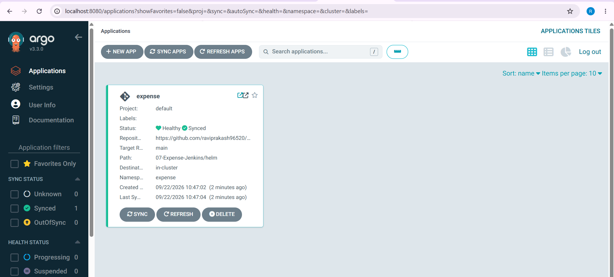

*Expense application registered in Argo CD and synchronized to the EKS cluster.*

---

## 20. GitOps Deployment Flow

When Jenkins builds a new version:

```text
1. Jenkins builds backend/frontend images.
2. Jenkins pushes the tagged images to ECR.
3. Jenkins updates imageVersion in helm/values-dev.yaml.
4. Jenkins commits and pushes values-dev.yaml to main.
5. Argo CD detects the Git commit.
6. Argo CD renders the Helm chart.
7. Argo CD updates the EKS workloads.
8. Kubernetes performs the rollout.
```

Check Argo CD:

```bash
kubectl get application expense -n argocd
```

Check the application:

```bash
kubectl get all -n expense
kubectl get ingress -n expense
```

The final Expense UI is shown below.

The screenshot below confirms that the Expense application is reachable through the AWS load balancer and the UI is working.

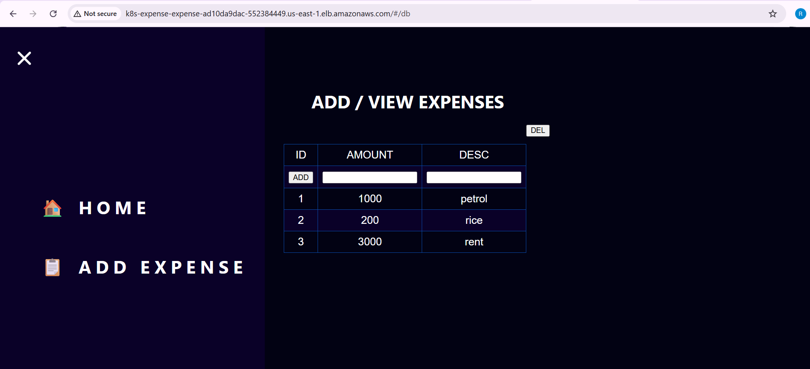

*The deployed Expense application accessed through the AWS Load Balancer endpoint.*

---

# Phase 7 - Monitoring

## 21. Create the Monitoring Namespace

```bash
kubectl create namespace monitoring
```

A `kube-prometheus-stack` deployment was used for Prometheus, Grafana, Alertmanager, node-exporter, kube-state-metrics and the Prometheus Operator.

A reproducible Helm installation is:

```bash
helm repo add prometheus-community https://prometheus-community.github.io/helm-charts
helm repo update

helm upgrade --install kube-prometheus-stack \
  prometheus-community/kube-prometheus-stack \
  -n monitoring \
  --create-namespace
```

Verify:

```bash
kubectl get pods -n monitoring
kubectl get svc -n monitoring
```

---

## 22. Access Prometheus

```bash
kubectl port-forward \
  -n monitoring \
  svc/kube-prometheus-stack-prometheus \
  9090:9090
```

Open:

```text
http://localhost:9090
```

The screenshot below shows the Prometheus UI after the monitoring stack was deployed and accessed through port-forwarding.

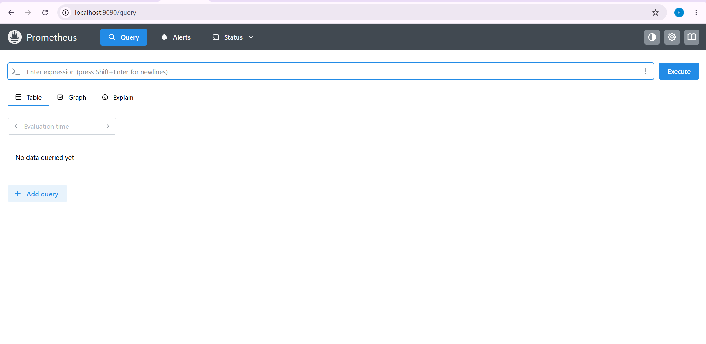

*Prometheus accessed through port-forwarding after installing the monitoring stack.*

---

## 23. Access Grafana

```bash
kubectl port-forward \
  -n monitoring \
  svc/kube-prometheus-stack-grafana \
  3000:80
```

Open:

```text
http://localhost:3000
```

The Grafana dashboard confirms Kubernetes/node CPU and related metrics are being collected.

The screenshot below shows Grafana visualizing Kubernetes CPU and memory metrics from the EKS cluster.

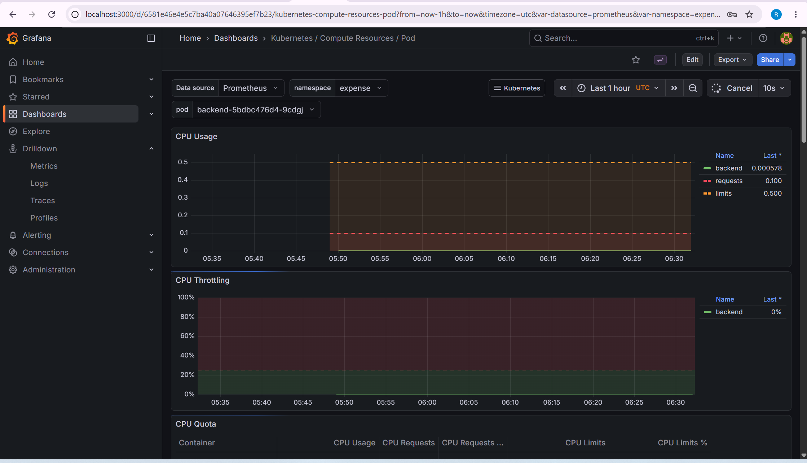

*Grafana dashboard displaying Kubernetes/node resource metrics collected by Prometheus.*

---

# Phase 8 - Centralized Logging

## 24. Create the Logging Namespace

```bash
kubectl create namespace logging
```

Add the Elastic Helm repository:

```bash
helm repo add elastic https://helm.elastic.co
helm repo update
```

Install the ECK operator:

```bash
helm upgrade --install elastic-operator elastic/eck-operator \
  -n logging \
  --create-namespace
```

Verify:

```bash
kubectl get pods -n logging
```

> Pin the exact ECK operator chart version in production. The application charts below were installed with chart version `0.18.0`.

---

## 25. Install Elasticsearch

Apply the EBS StorageClass first:

```bash
kubectl apply -f observability/storageclass.yaml
```

Install Elasticsearch:

```bash
helm install eck-elasticsearch elastic/eck-elasticsearch \
  --version 0.18.0 \
  -n logging
```

Verify:

```bash
kubectl get es -n logging
kubectl get pods -n logging
kubectl get pvc -n logging
```

---

## 26. Install Filebeat as a DaemonSet

The Filebeat values use Elastic version `9.3.0` and connect to `eck-elasticsearch` in the `logging` namespace.

Important design:

```text
DaemonSet -> one Filebeat pod on every Kubernetes node
```

Render the chart before installation if required:

```bash
helm template eck-beats elastic/eck-beats \
  --version 0.18.0 \
  -n logging \
  -f observability/filebeat-values.yaml
```

Install:

```bash
helm install eck-beats elastic/eck-beats \
  --version 0.18.0 \
  -n logging \
  -f observability/filebeat-values.yaml
```

Verify:

```bash
kubectl get beats -n logging
kubectl get pods -n logging -o wide
```

Expected health after every Filebeat pod is available:

```text
HEALTH: green
AVAILABLE: same as EXPECTED
```

---

## 27. Install Kibana

```bash
helm install eck-kibana elastic/eck-kibana \
  --version 0.18.0 \
  -f observability/eck-kibana-0.18.0.yaml \
  -n logging
```

Verify:

```bash
kubectl get kibana -n logging
kubectl get pods -n logging
```

---

## 28. Access Elasticsearch

Port-forward:

```bash
kubectl port-forward \
  service/eck-elasticsearch-es-http \
  9200:9200 \
  -n logging
```

Open:

```text
https://localhost:9200
```

Retrieve the generated `elastic` user password:

```bash
kubectl get secret eck-elasticsearch-es-elastic-user \
  -n logging \
  -o go-template='{{.data.elastic | base64decode}}{{"\n"}}'
```

---

## 29. Access Kibana

In a second terminal:

```bash
kubectl port-forward \
  service/eck-kibana-kb-http \
  5601:5601 \
  -n logging
```

Open:

```text
https://localhost:5601
```

Login:

```text
Username: elastic
Password: <password retrieved from the Kubernetes Secret>
```

---

## 30. Verify Logs in Kibana Discover

The completed stack successfully showed Kubernetes logs in Kibana Discover.

Useful KQL filters:

All Expense namespace logs:

```text
kubernetes.namespace:"expense"
```

Backend only:

```text
kubernetes.namespace:"expense" AND kubernetes.container.name:"backend"
```

Frontend only:

```text
kubernetes.namespace:"expense" AND kubernetes.container.name:"frontend"
```

MySQL only:

```text
kubernetes.namespace:"expense" AND kubernetes.container.name:"mysql"
```

The screenshot below shows Kubernetes logs successfully collected by Filebeat, stored in Elasticsearch, and queried from Kibana Discover.

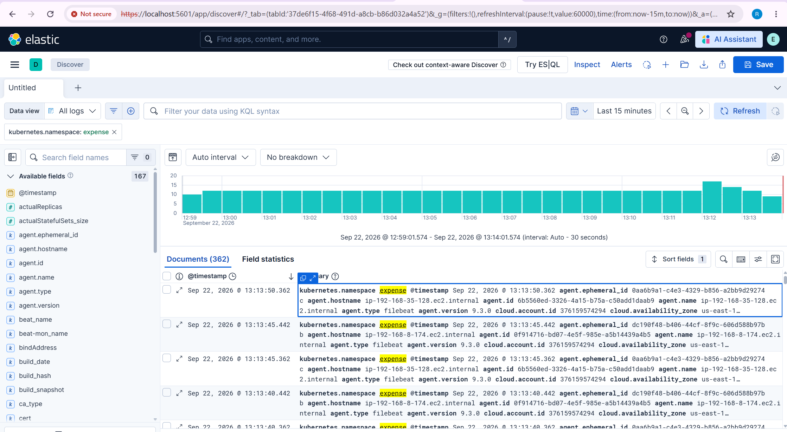

*Kubernetes logs collected by Filebeat, stored in Elasticsearch, and viewed in Kibana Discover.*

At this point the logging flow is complete:

```text
Kubernetes container logs
          |
          v
/var/log/containers
          |
          v
Filebeat DaemonSet
          |
          v
Elasticsearch
          |
          v
Kibana Discover
```

---

# Validation

## Jenkins

```bash
sudo systemctl status jenkins
```

Expected:

```text
active (running)
```

## Jenkins Agent

```text
Manage Jenkins -> Nodes -> agent-1 -> Online
```

## EKS

```bash
kubectl get nodes
kubectl get pods -A
```

## Expense Application

```bash
kubectl get pods -n expense
kubectl get svc -n expense
kubectl get ingress -n expense
```

## Argo CD

```bash
kubectl get applications -n argocd
```

Expected:

```text
Synced
Healthy
```

## Monitoring

```bash
kubectl get pods -n monitoring
kubectl get svc -n monitoring
```

## Logging

```bash
kubectl get pods -n logging
kubectl get beats -n logging
kubectl get kibana -n logging
kubectl get es -n logging
```

---

# Troubleshooting Performed

One of the most valuable parts of this project was troubleshooting real failures instead of only performing a happy-path installation.

## 1. Jenkins Agent Java Mismatch

Problem:

```text
UnsupportedClassVersionError / Java class-version mismatch
```

Cause:

```text
Jenkins controller and agent Java versions did not match requirements.
```

Fix:

```text
Install Java 21 on the agent and validate java -version.
```

---

## 2. Jenkins Agent Disk Space

Problem:

```text
Docker/scanner operations consumed the small filesystem.
```

Checks:

```bash
df -h
lsblk
sudo lvs
```

Fix:

```text
Expand the required LVM/XFS logical volume and filesystem.
```

---

## 3. SonarQube Quality Gate Webhook

Problem:

```text
waitForQualityGate() cannot complete correctly without SonarQube -> Jenkins callback.
```

Fix:

```text
Configure /sonarqube-webhook/ in SonarQube and make Jenkins reachable from SonarQube.
```

---

## 4. EBS CSI Controller IRSA Failure

Observed error:

```text
sts:AssumeRoleWithWebIdentity AccessDenied
```

Cause:

```text
The EBS CSI controller IAM role trust/OIDC association was incorrect.
```

Fix:

```text
Verify cluster OIDC provider, recreate/repair the EBS CSI IAM role association,
then verify ebs-csi-controller pods become 6/6 Running.
```

Useful commands:

```bash
eksctl utils associate-iam-oidc-provider \
  --cluster expense \
  --region us-east-1 \
  --approve

kubectl get pods -n kube-system | grep ebs
```

---

## 5. Elasticsearch PVC Pending

Observed:

```text
WaitForFirstConsumer
waiting for pod to be scheduled
```

This was **not an EBS failure**. `WaitForFirstConsumer` was expected because the StorageClass waited until the Elasticsearch pod had a target node/AZ.

The actual pod scheduling event showed:

```text
Insufficient memory
Too many pods
```

---

## 6. Kubernetes `Too many pods`

The `t3.medium` nodes in this cluster showed a pod capacity of:

```text
pods: 17
```

Some nodes were already at their pod limit, so new Elasticsearch/Filebeat/Kibana pods could not schedule.

Useful commands:

```bash
kubectl describe pod <POD> -n logging
kubectl get pods -A -o wide --sort-by=.spec.nodeName
kubectl describe node <NODE>
```

Fixes used during the lab:

```text
- Redistribute workload pods when required.
- Scale the managed node group.
- Final lab scale: 4 worker nodes.
```

Scale command:

```bash
eksctl scale nodegroup \
  --cluster expense \
  --name expense \
  --nodes 4 \
  --nodes-min 2 \
  --nodes-max 4 \
  --wait
```

---

## 7. Filebeat DaemonSet Pending

Observed event:

```text
1 Too many pods
2 node(s) didn't satisfy plugin(s) [NodeAffinity]
```

The NodeAffinity message was expected for a DaemonSet because each Filebeat pod targets a specific node. The real blocker was that the target node had reached its pod limit.

After freeing/scaling capacity, all Filebeat pods became `Running` and the Beat health became green.

---

## 8. Kibana Pending

Observed event:

```text
0/3 nodes are available:
1 Insufficient memory,
2 Too many pods
```

The fix was cluster capacity, not a Kibana configuration change.

---

# Cleanup

To avoid unnecessary AWS cost, remove workload resources before deleting the EKS cluster.

## 1. Stop Port-Forwards

Press:

```text
Ctrl + C
```

in each port-forward terminal.

## 2. Remove Logging Stack

```bash
helm uninstall eck-kibana -n logging
helm uninstall eck-beats -n logging
helm uninstall eck-elasticsearch -n logging
helm uninstall elastic-operator -n logging
kubectl delete namespace logging
```

## 3. Remove Monitoring

```bash
helm uninstall kube-prometheus-stack -n monitoring
kubectl delete namespace monitoring
```

## 4. Remove Argo CD

```bash
helm uninstall argo-cd -n argocd
kubectl delete namespace argocd
```

## 5. Remove Expense Application

```bash
kubectl delete namespace expense
```

Before cluster deletion, verify that AWS Load Balancers and persistent volumes created for the application are being cleaned up:

```bash
kubectl get ingress -A
kubectl get svc -A
kubectl get pvc -A
kubectl get pv
```

## 6. Delete EKS Cluster

```bash
eksctl delete cluster --name expense --region us-east-1
```

Finally verify the AWS console for any resources that may have been created separately from `eksctl`, such as standalone EC2 instances used for Jenkins, Jenkins agent and SonarQube.

---

# Interview Explanation

A concise way to explain this project in an interview:

> I implemented an end-to-end DevSecOps workflow for a three-tier Expense application. Jenkins is used for CI: it checks out the code, runs GitLeaks, Snyk, SonarQube and Checkov, builds backend and frontend Docker images, generates CycloneDX SBOMs with Syft, scans images using Trivy and pushes versioned images to Amazon ECR. Jenkins then updates the image versions in the Helm `values-dev.yaml` file and pushes that change to Git. Argo CD watches the Helm path and automatically synchronizes the new desired state to Amazon EKS. The application is exposed through the AWS Load Balancer Controller. For observability I installed Prometheus and Grafana for metrics and ECK Elasticsearch, Filebeat and Kibana for Kubernetes logs. I also troubleshot EBS CSI IRSA issues, PVC `WaitForFirstConsumer`, insufficient memory, EKS pod-density limits, Filebeat DaemonSet scheduling and Kibana scheduling failures.

The key architectural point is:

```text
Jenkins = CI + GitOps update
Argo CD = CD
ECR = image registry
EKS = runtime
Prometheus/Grafana = metrics
Elastic/Filebeat/Kibana = logs
```

---

# Production Hardening Notes

This project is a hands-on lab and interview project. For production, improve it further by:

- Use IAM roles instead of long-lived AWS keys on the Jenkins agent.
- Keep secrets in a proper secret-management system.
- Restrict Jenkins, SonarQube, Argo CD and observability endpoints to trusted networks.
- Pin container, Helm chart and scanner versions/digests.
- Make selected security gates blocking based on organizational policy.
- Use highly available Jenkins/SonarQube/Elastic designs where required.
- Configure resource requests/limits for all workloads.
- Use Cluster Autoscaler or Karpenter for automatic node capacity management.
- Configure Prometheus alerts and Alertmanager notification routes.
- Define log retention/index lifecycle policies in Elasticsearch.
- Back up persistent data and test restore procedures.
- Use TLS certificates and managed DNS for externally exposed endpoints.

---

# Result

The completed project demonstrates the full lifecycle:

```text
Code
  -> CI
  -> Security Scanning
  -> Container Build
  -> SBOM
  -> Image Scan
  -> ECR
  -> GitOps Update
  -> Argo CD
  -> EKS
  -> Monitoring
  -> Centralized Logging
  -> Troubleshooting
  -> Cleanup
```

This makes the `07-Expense-Jenkins` folder a complete hands-on example of **Jenkins CI + Argo CD GitOps CD + Amazon EKS + DevSecOps + Observability**.
